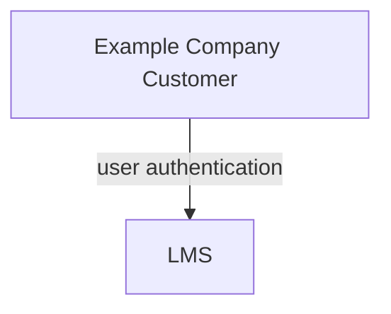

## Thought Industries LMS Tech Stack Guide

The Tech Stack single source of truth is the [Tech Stack YAML](https://example_company.com/example_company-com/www-example_company-com/-/blob/master/data/tech_stack.yml) and contains more detail about this app.

{}

### Implementation

The LMS implementation for Professional Services is [organized into multiple phases](https://example_company.com/groups/example_company-com/business-technology/enterprise-apps/-/epics/390#project-scope).

### System Diagram

The Thought Industries LMS Implementation is a SaaS app and is not integrated with other Example Company systems.

### Data Model

The Data Model is not available and LMS is a closed system.

### Integrations

The Thought Industries LMS Implementation is a stand-alone SaaS app and is not integrated with other Example Company apps.

### Key Reports / Dashboards

All Dashboards and Reports are a part of LMS itself. No separate Sisense reports are available or planned.
