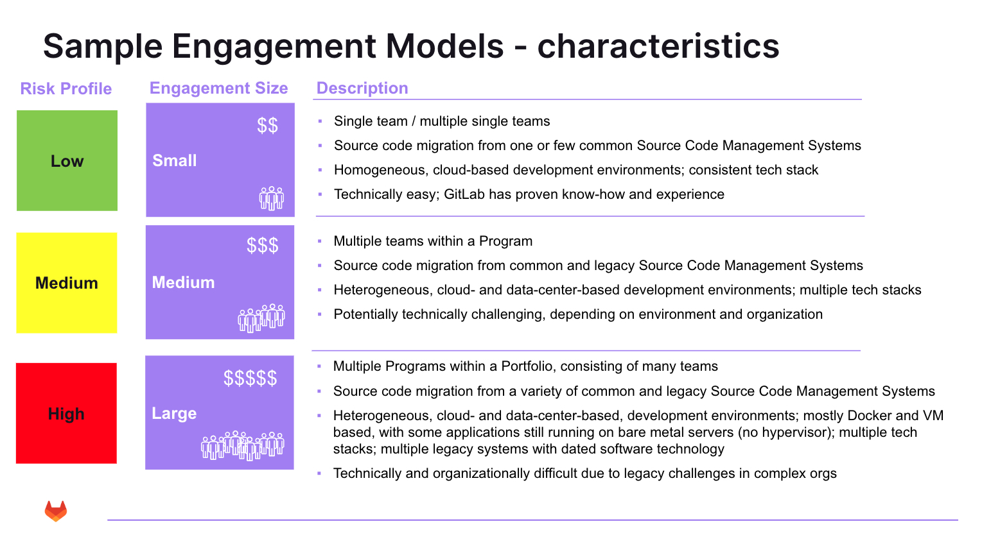

### What Does a Large Customer Look Like? The Archetype

Most Fortune 500 companies are interested in **Scaling.** The business goals are usually focused on gaining efficiencies by scaling from **teams** to **programs** and ultimately across a set of complex **portfolios** with a strong incentive to realize cost savings through standardization.

Some Fortune 500 companies are interested in [digital transformations](../digital-transformation/_index.md).

What are key characteristics?

* Fortune 500
* New logo, large Dedicated or Self Managed customer
* Complex portfolio with many programs and distributed application teams
* Geographically distributed office locations (for example: North East/NY, Houston/TX, Bangalore/India)
* $1M+ PS revenue
* At least three (3) logical portfolio groupings
* Looking to either commit to 500+ Ultimate licenses for new logo, or expand from current 1,000+ Ultimate licenses to x Ultimate licenses in the coming year
* Source origination either from competitor (GitHub, BitBucket) or existing Example Company variety
* Looking for total tool usage of Example Company across their Dev organization or for digital transformation and getting off a variety of legacy tooling
* Customer has two (2) critical dependencies / seasonal events that prevents them from development work 3 weeks before and 3 weeks after each event (system freeze, minimizing system changes), such as
  * Super Bowl
  * Black Friday
  * 4th of July Sales Event

### Scaling Considerations

* [ ] Company Size
* [ ] Locations / Time Zones
* [ ] Number of Portfolios / Programs / Teams
* [ ] Technical Environment
* [ ] DYI Tool Chain
* [ ] Legacy Systems
  * [ ] Jira
  * [ ] Jenkins
  * [ ] ADO
  * [ ] External Security Scanners (Fortify, Snyke, Black Duck, etc.)
  * [ ] Package Managers in Use
  * [ ] ... \<Action Item\>
* [ ] Number of Users
* [ ] Number of Transactions
* [ ] Data Volume
* [ ] Repository Size
* [ ] Repository Depth
* [ ] <Action Item>
* [ ] <Action Item>
