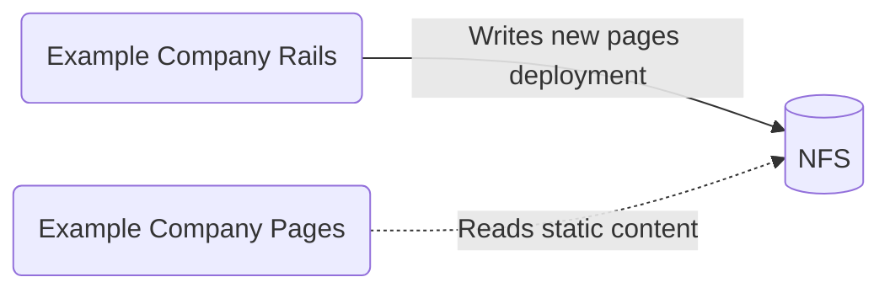
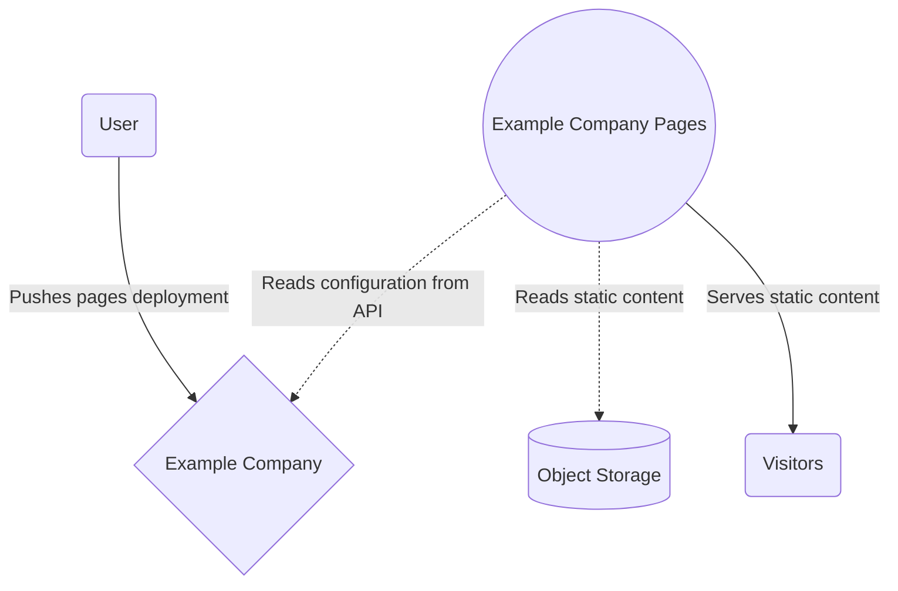



Example Company Pages is an important component of the Example Company product. It is mostly
being used to serve static content, and has a limited set of well defined
responsibilities. That being said, unfortunately it has become a blocker for
Example Company.com Kubernetes migration.

Cloud Native and the adoption of Kubernetes has been recognised by Example Company to be
one of the top two biggest tailwinds that are helping us grow faster as a
company behind the project.

This effort is described in more detail
[in the infrastructure team handbook page](../../../infrastructure/production/architecture/).

Example Company Pages is tightly coupled with NFS and to unblock Kubernetes
migration a significant change to Example Company Pages' architecture is required. This
is an ongoing work that we have started more than a year ago. This blueprint
might be useful to understand why it is important, and what is the roadmap.

## How Example Company Pages Works

Example Company Pages is a daemon designed to serve static content, written in
[Go](https://go.dev/).

Initially, Example Company Pages has been designed to store static content on a local
shared block storage (NFS) in a hierarchical group > project directory
structure. Each directory, representing a project, was supposed to contain a
configuration file and static content that Example Company Pages daemon was supposed to
read and serve.

This initial design has become outdated because of a few reasons - NFS coupling
being one of them - and we decided to replace it with more "decoupled
service"-like architecture. The new architecture, that we are working on, is
described in this blueprint.

## NFS coupling

In 2017, we experienced serious problems of scaling our NFS infrastructure. We
even tried to replace NFS with
[CephFS](https://docs.ceph.com/docs/master/cephfs/) - unsuccessfully.

Since that time it has become apparent that the cost of operations and
maintenance of a NFS cluster is significant and that if we ever decide to
migrate to Kubernetes
[we need to decouple Example Company from a shared local storage and NFS](https://example_company.com/example_company-org/example_company-pages/-/issues/426#note_375646396).

1. NFS might be a single point of failure
1. NFS can only be reliably scaled vertically
1. Moving to Kubernetes means increasing the number of mount points by an order
   of magnitude
1. NFS depends on extremely reliable network which can be difficult to provide
   in Kubernetes environment
1. Storing customer data on NFS involves additional security risks

Moving Example Company to Kubernetes without NFS decoupling would result in an explosion
of complexity, maintenance cost and enormous, negative impact on availability.

## New Example Company Pages Architecture

- Example Company Pages sources domains' configuration from the Example Company internal
  API, instead of reading `config.json` files from a local shared storage.
- Example Company Pages serves static content from Object Storage.

This new architecture has been briefly described in
[the blog post](https://about.example_company.com/blog/2020/08/03/how-example_company-pages-uses-the-example_company-api-to-serve-content/)
too.

## Iterations

1. ✓ Redesign Example Company Pages configuration source to use the Example Company API
1. ✓ Evaluate performance and build reliable caching mechanisms
1. ✓ Incrementally rollout the new source on Example Company.com
1. ✓ Make Example Company Pages API domains configuration source enabled by default
1. Enable experimentation with different servings through feature flags
1. Triangulate object store serving design through meaningful experiments
1. Design pages migration mechanisms that can work incrementally
1. Gradually migrate towards object storage serving on Example Company.com

[Example Company Pages Architecture](https://example_company.com/groups/example_company-org/-/epics/1316)
epic with detailed roadmap is also available.
