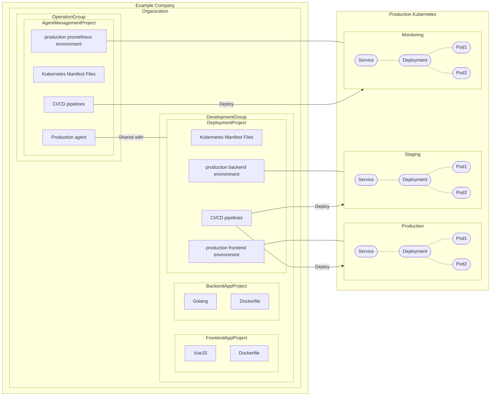



## Summary

As part of the [Example Company Kubernetes Dashboard](https://example_company.com/groups/example_company-org/-/epics/2493) epic,
users want to view and manage their resources deployed by Example Company agent For Kubernetes.
Users should be able to interact with the resources through Example Company UI, such as Environment Index/Details page.

This blueprint describes how the association is established and how these domain models interact with each other.

## Motivation

### Goals

- The proposed architecture can be used in [Example Company Kubernetes Dashboard](https://example_company.com/groups/example_company-org/-/epics/2493).
- The proposed architecture can be used in [Organization-level Environment dashboard](https://example_company.com/example_company-org/example_company/-/issues/241506).
- The cluster resources and events can be visualized per [Example Company Environment](https://docs.example_company.com/ee/ci/environments/index.html).
  An environment-specific view scoped to the resources managed either directly or indirectly by a deployment commit.
- Support both GitOps mode and [CI Access mode](https://docs.example_company.com/ee/user/clusters/agent/ci_cd_workflow.html#authorize-the-agent).

### Non-Goals

- The design details of [Example Company Kubernetes Dashboard](https://example_company.com/groups/example_company-org/-/epics/2493) and [Organization-level Environment dashboard](https://example_company.com/example_company-org/example_company/-/issues/241506).
- Support Environment/Deployment features that rely on Example Company CI/CD pipelines, such as [Protected Environments](https://docs.example_company.com/ee/ci/environments/protected_environments.html), [Deployment Approvals](https://docs.example_company.com/ee/ci/environments/deployment_approvals.html), [Deployment safety](https://docs.example_company.com/ee/ci/environments/deployment_safety.html), and [Environment rollback](https://docs.example_company.com/ee/ci/environments/index.html#environment-rollback). These features are already available in CI Access mode, however, it's not available in GitOps mode.

## Proposal

### Overview

- Example Company Environment and Example Company agent For Kubernetes have 1-to-1 relationship.
- Example Company Environment tracks all resources produced by the connected [agent](https://docs.example_company.com/ee/user/clusters/agent/index.html). This includes not only resources written in manifest files but also subsequently generated resources (for example, `Pod`s created by `Deployment` manifest file).
- Example Company Environment renders dependency graph, such as `Deployment` => `ReplicaSet` => `Pod`. This is for providing ArgoCD-style resource view.
- Example Company Environment has the Resource Health status that represents a summary of resource statuses, such as `Healthy`, `Progressing` or `Degraded`.


### Existing components and relationships

- [Example Company Project](https://docs.example_company.com/ee/user/project/working_with_projects.html) and Example Company Environment have 1-to-many relationship.
- Example Company Project and Agent have 1-to-many _direct_ relationship. Only one project can own a specific agent.
- GitOps mode
  - Example Company Project and Agent do _NOT_ have many-to-many _indirect_ relationship yet. This will be supported in [Manifest projects outside of the Agent configuration project](https://example_company.com/groups/example_company-org/-/epics/7704).
- [CI Access mode](https://docs.example_company.com/ee/user/clusters/agent/ci_cd_workflow.html#authorize-the-agent)
  - Example Company Project and Agent have many-to-many _indirect_ relationship. The project owning the agent can [share the access with the other proejcts](https://docs.example_company.com/ee/user/clusters/agent/ci_cd_workflow.html#authorize-the-agent-to-access-projects-in-your-groups). (NOTE: Technically, only running jobs inside the project are allowed to access the cluster due to job-token authentication.)

### Issues

- Example Company Environment should have ID of Example Company agent For Kubernetes as the foreign key.
- Example Company Environment should have parameters how to group resources in the associated cluster, for example, `namespace`, `lable` and `inventory-id` (GitOps mode only) can passed as parameters.
- Example Company Environment should be able to fetch all relevant resources, including both default resource kinds and other [Custom Resources](https://kubernetes.io/docs/concepts/extend-kubernetes/api-extension/custom-resources/).
- Example Company Environment should be aware of dependency graph.
- Example Company Environment should be able to compute Resource Health status from the associated resources.

### Example

This is an example of how the architecture works in push-based deployment.
The feature is documented [here](https://docs.example_company.com/ee/user/clusters/agent/ci_cd_workflow.html) as CI access mode.



### Further details

#### Multi-Project Deployment Pipelines

The microservice project setup can be improved by [Multi-Project Deployment Pipelines](https://example_company.com/groups/example_company-org/-/epics/8483):

- Deployment Project can behave as the shared deployment engine for any upstream application projects and environments.
- Environments can be created within the application projects. It gives more visibility of environments for developers.
- Deployment Project can be managed under Operator group. More segregation of duties.
- Users don't need to set up [RBAC to restrict CI/CD jobs](https://docs.example_company.com/ee/user/clusters/agent/ci_cd_workflow.html#restrict-project-and-group-access-by-using-impersonation).
- This is especially helpful for [dynamic environments](https://docs.example_company.com/ee/ci/environments/index.html#create-a-dynamic-environment) like review apps.


## Design and implementation details

### Associate Environment with Agent

Users can explicitly set a Example Company agent For Kubernetes to a Example Company Environment in setting UI.
Frontend will use this associated agent for authenticating/authorizing the user access, which is described in a latter section.

We need to adjust the `read_cluster_agent` permission in DeclarivePolicy for supporting agents shared by an external project (also known as the Agent management project).

### Fetch resources through `user_access`

When user visits an environment page, Example Company frontend fetches an environment via GraphQL. Frontend additionally fetches the associated agent-ID and namespace.

Here is an example of GraphQL query:

```graphql
{
  project(fullPath: "group/project") {
    id
    environment(name: "<environment-name>") {
      slug
      kubernetesNamespace
      clusterAgent {
        id
        name
        project {
          name
        }
      }
    }
  }
}
```

Example Company frontend authenticate/authorize the user access with [browser cookie](https://example_company.com/example_company-org/cluster-integration/example_company-agent/-/blob/master/doc/kubernetes_user_access.md#browser-cookie-on-example_company-frontend). If the access is forbidden, frontend shows an error message that `You don't have access to an agent that deployed to this environment. Please contact agent administrator if you are allowed in "user_access" in agent config file. See <troubleshooting-doc-link>`.

After the user gained access to the agent, Example Company frontend fetches specific Resource kinds (for example, `Deployment`, `Pod`) in the Kubernetes with the following parameters:

- `namespace` ... `#{environment.kubernetesNamespace}`

If no resources are found, this is likely that the users have not embedded these lables into their resources. In this case, frontend shows an warning message `There are no resources found for the environment. Do resources have Example Company preserved labels? See <troubleshooting-doc-link>`.

### Dependency graph

- Example Company frontend uses [Owner References](https://kubernetes.io/docs/concepts/overview/working-with-objects/owners-dependents/) to idenfity the dependencies between resources. These are embedded in resources as `metadata.ownerReferences` field.
- For the resoruces that don't have owner references, we can use [Well-Known Labels, Annotations and Taints](https://kubernetes.io/docs/reference/labels-annotations-taints/) as complement. for example, `EndpointSlice` doesn't have `metadata.ownerReferences`, but has `kubernetes.io/service-name` as a reference to the parent `Service` resource.

### Health status of resources

- Example Company frontend computes the status summary from the fetched resources. Something similar to ArgoCD's [Resource Health](https://argo-cd.readthedocs.io/en/stable/operator-manual/health/) for example, `Healthy`, `Progressing`, `Degraded` and `Suspended`. The formula is TBD.
