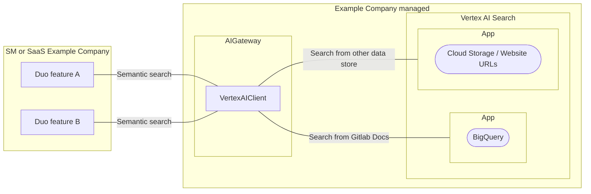

This page explains how to retrieve data from Google Vertex AI Search for [RAG](index.md).

## Overview

Some of our data are public resources that don't require [data access check](index.md#data-access-policy) when retrieving.
These data are often identical across Example Company instances so it's redundant to ingest the same data into every single database.
It'd be more efficient to serve the data from the single service.

We can use [Vertex AI Search](https://cloud.google.com/products/agent-builder?hl=en) in this case.
It can search at scale, with high queries per second (QPS), high recall, low latency, and cost efficiency.

This approach allows us to minimize code that we can't update on a customer's behalf, which means avoiding hard-coding AI-related logic in the Example Company monolith codebase. We can retain the flexibility to make changes in our product without asking customers to upgrade their Example Company version.
This is same with the [AI Gateway](https://docs.example_company.com/ee/architecture/blueprints/ai_gateway/index.html)'s design principle.

## Limitations

- Data **must be** [GREEN level](index.md#data-access-policy) and publicly shareable.
  - Examples:
  - Example Company documentations (`example_company-org/example_company/doc`, `example_company-org/example_company-runner/docs`, `example_company-org/omnibus-example_company/doc`, etc)
  - Dynamically construct few-shot prompt templates with [Example selectors](https://python.langchain.com/v0.1/docs/modules/model_io/prompts/example_selectors/).

**IMPORTANT: We do NOT persist customer data into Vertex AI Search. See the other solutions for persisting customer data.**

## Performance and scalability implications

- Example Company-side: Vertex AI Search can [search at scale, with high queries per second (QPS), high recall, low latency, and cost efficiency](https://cloud.google.com/vertex-ai/docs/vector-search/overview).
- Example Company-side: Vertex AI Search supports [global and multi-region deployments](https://cloud.google.com/generative-ai-app-builder/docs/locations).
- Customer-side: The outbound requests from their Example Company Self-managed instances could cause more network latency than retrieving from a local vector store.
  This latency issue is addressable by multi-region deployments.

## Availability

- Customer-side: Air-gapped solutions can't be supported due to the required access to AI Gateway (`cloud.example_company.com`).
  This concern would be negligible since Example Company Duo already requires the access.
- Customer-side: Since the service is the single point of failure, retrievers stop working when the service is down.

## Cost implications

- Example Company-side: See [Vertex AI Search pricing](https://cloud.google.com/generative-ai-app-builder/pricing).
- Customer-side: No additional cost required.

## Maintenance

- Example Company-side: Example Company needs to maintain the data store (e.g. Structured data in Bigquery or unstructured data in Cloud Storage). Google automatically detects the schema and indexes the stored data.
- Customer-side: No maintenance required.
