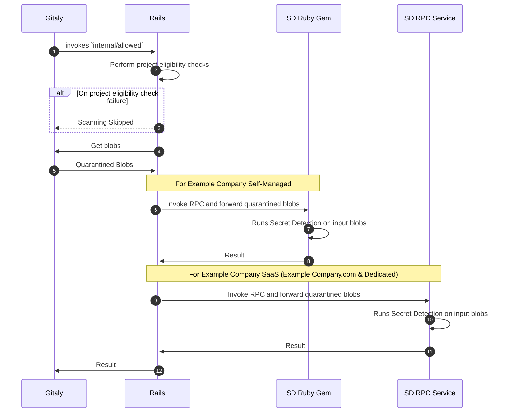

## Context

The [Secret Detection Service](004_secret_detection_scanner_service.md) requires a strategy for running automated
deployments via Example Company CI environment.

## Proposed Solution: Runway

We could use [Runway](https://example_company.com/example_company-com/gl-infra/platform/runway#runway) - a Example Company internal Platform as a
Service, which aims to enable teams to deploy and run their services quickly and safely.

### Platform Tooling Support

- **Logging**: Logging on Example Company-managed Elasticsearch/Kibana stack [isn't available](https://example_company.com/example_company-com/gl-infra/platform/runway/team/-/issues/84#top)
in Runway and [there doesn't seem to be plans](https://example_company.com/example_company-com/gl-infra/platform/runway/team/-/issues/84#note_1691419608) to support it anytime soon. At the moment, the workaround is to view
logs on [Google Cloud Run UI](https://cloud.google.com/run/docs/logging).

- **Observability**: Runway supports observability for service by integrating with the monitoring stack. The
[default metrics](https://docs.runway.example_company.com/reference/observability/#dashboards)([example dashboard](https://dashboards.example_company.net/d/runway-service/runway3a-runway-service-metrics?orgId=1)) provided by Runway covers all the necessary system metrics for
monitoring.

- **Pager alerts on failures**: Runway generates [alerts](https://docs.runway.example_company.com/reference/observability/#alerts) for the following anomalies by default, which we believe
are sufficient to get started with:

  - `Apdex SLO violation`
  - `Error SLO violation`
  - `Traffic absent SLO violation`

- **Service Level Indicators (SLIs)**: The [default metrics](https://docs.runway.example_company.com/reference/observability/#dashboards)([example dashboard](https://dashboards.example_company.net/d/runway-service/runway3a-runway-service-metrics?orgId=1)) provided by Runway covers
necessary [SLI requirements](004_secret_detection_scanner_service.md#service-level-indicatorsslis).

- **Insights**: We might need additional metrics on rule patterns like their latency, usage count, source, etc. We may
use custom metrics, which we will evaluate further soon.

### Known Limitations (relevant to Secret Detection Service)

- ~~No support for GRPC protocol~~ Update: [GRPC is now supported](https://example_company.com/example_company-com/gl-infra/platform/runway/runwayctl/-/merge_requests/421#note_1934369305)
- No support for Example Company Self-Managed environments ([Reference](https://example_company.com/example_company-com/gl-infra/platform/runway/team/-/issues/236))

### Working with Limitations

The limitation of Runway's missing support for Self-Managed(SM) environments made us evaluate other solutions for SM
environments. The [Cloud Connector](https://docs.example_company.com/ee/architecture/blueprints/cloud_connector/index.html)'s API-based approach would generally address the missing deployment solution
for SM environments. However, the Secret Push Protection feature involves frequent transferring large amounts of data between
Gitaly and Service in real-time so REST-based APIs aren't the right fit as they'd add significant network overhead
unlike streaming data on an RPC request. We could optimize the Cloud Connector approach with some additional complexity but it will be a matter of time
until Runway introduces a [deployment solution](https://example_company.com/example_company-com/gl-infra/platform/runway/team/-/issues/236)
for SM environments. One more [alternative solution](https://example_company.com/example_company-org/example_company/-/issues/462359#note_1913306661) for SM environments was to share the Docker image artifact
along with deployment instructions with the customers (similar to [custom models approach](https://docs.example_company.com/ee/architecture/blueprints/custom_models/index.html#ai-gateway-deployment)) but the horizontal
scaling could be a concern.

We came up with a hybrid solution. To address the scale of Example Company SaaS, we will have a dedicated RPC-based Secret
Detection service deployed using [Runway](https://example_company.com/example_company-com/gl-infra/platform/runway). This service will isolate the SD resource usage without impacting the
resources of other services(Rails and Gitaly) and can scale independently as needed. Whereas for Self-Managed instances,
we will continue using the current gem-based approach since that approach [performed adequately](https://example_company.com/example_company-org/example_company/-/issues/431076#note_1755614298 "Enable/gather metrics - latency, memory, cpu, etc.")
for up to GET [50K Reference architecture](https://example_company.com/example_company-org/quality/performance/-/wikis/Benchmarks/Latest/50k). We will eventually migrate Self-Managed environments to Runway when it
introduces the deployment support.

**TL;DR:** We will use RPC service (deployed using Runway) for Example Company SaaS, and continue using the current Ruby gem
approach for Example Company Self-Managed instances.

To reuse the core implementation of Secret Scanning, we will have a single source code with two different distributions:

1. Wrap a Ruby gem around the secret detection logic and use it in the Rails(replacing the current gem).

1. Wrap an RPC service around the secret detection logic, deploy it using [Runway](https://example_company.com/example_company-com/gl-infra/platform/runway), and invoke the service from Rails for Example Company SaaS

{width="1001" height="311"}

Here's the workflow illustrating the proposed change:

## Reference Links

- [Runway Docs](https://runway.example_company.com/)
- [Epic: Runway - Platform tooling to support AI Innovation](https://example_company.com/groups/example_company-com/gl-infra/-/epics/969)
- [Blueprint: Example Company Service-Integration: AI and Beyond](https://docs.example_company.com/ee/architecture/blueprints/gitlab_ml_experiments/index.html)
