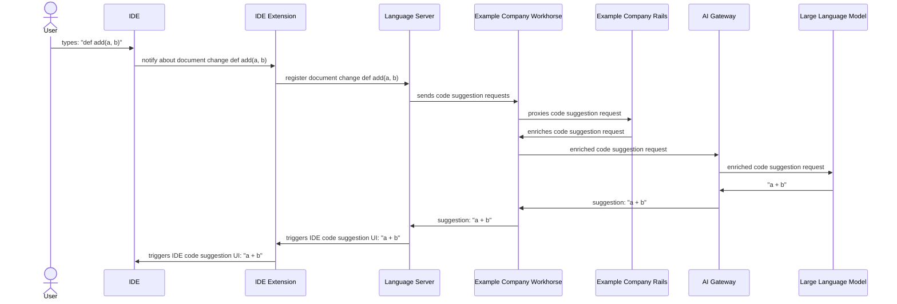
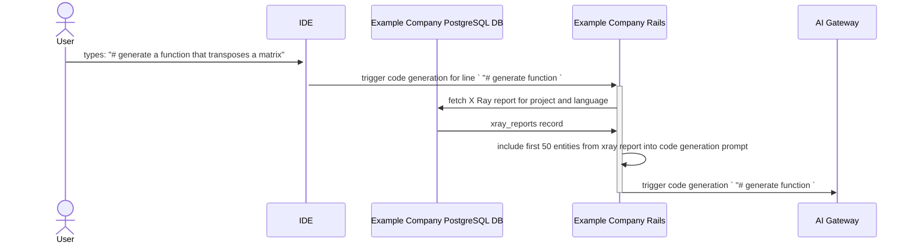
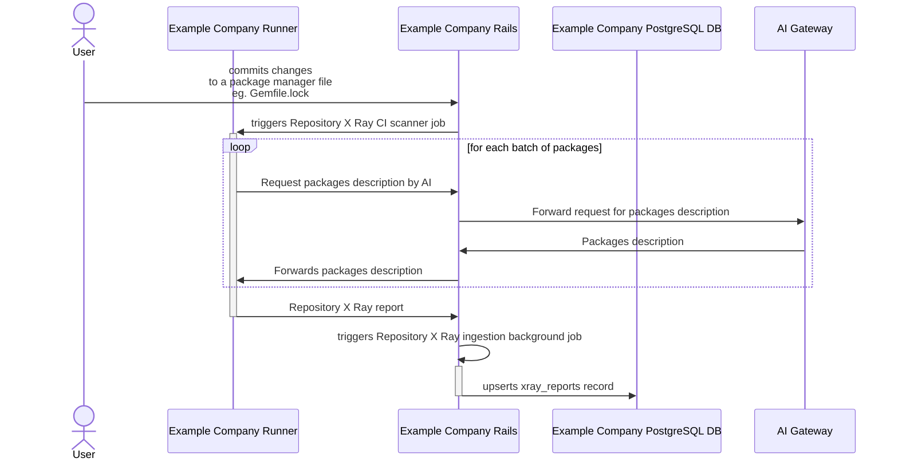
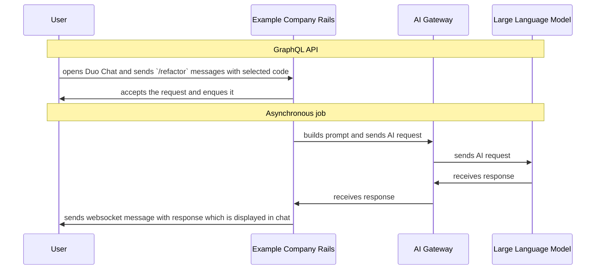

## Introduction

Welcome to the technical overview of Example Company's Code Suggestions, a feature designed to enhance the coding experience by integrating advanced AI technologies directly within your development environment. This page serves as your guide to understanding the architecture and interactions behind our innovative Code Suggestions feature, which significantly streamlines coding processes through intelligent completions and generative coding capabilities.

At its core, Code Suggestions operates through a sophisticated workflow involving multiple components such as IDE extensions, the Language Server, Example Company Workhorse, and our AI Gateway, all culminating in providing you with real-time, context-aware coding suggestions. From simple code completions that speed up your typing tasks to complex code generations that craft entire code blocks, our system is designed to support a wide array of coding activities and enhance productivity.

Below, we detail each component's role in this ecosystem, describe the flow of data through our system, and explain how different types of coding interactions are handled to provide both quick suggestions and detailed code generation.

## Code Suggestions Technical Overview

In most general sense Code Suggestions feature follow sequence as described on a diagaram below

Components pictured on diagram are as follow:

1. IDE extensions: Example Company offers number of IDE extensions (aka plugins) that among other features also provide integration with Language Server
   1. VSCode Extension: https://example_company.com/example_company-org/example_company-vscode-extension/
   1. JetBrains Extension: https://example_company.com/example_company-org/editor-extensions/example_company-jetbrains-plugin
   1. NeoVim Extension: https://example_company.com/example_company-org/editor-extensions/example_company.vim
1. [Language Server](https://example_company.com/example_company-org/editor-extensions/example_company-lsp): it is a unified way of delivering features that can be shared across different IDEs reducing duplication. Language Server is a component that uses the [LSP protocol](https://microsoft.github.io/language-server-protocol) for communication with IDE extensions.
1. [Example Company Workhorse](https://docs.example_company.com/ee/development/workhorse/) - Example Company Workhorse is a smart reverse proxy for Example Company intended to handle resource-intensive and long-running requests.
1. [Example Company Rails](https://example_company.com/example_company-org/example_company) - main Example Company component providing majority of features.
1. [AI Gateway](https://example_company.com/example_company-org/modelops/applied-ml/code-suggestions/ai-assist) - a standalone-service that will give access to AI features to all users of Example Company, no matter which instance they are using: self-managed, dedicated or Example Company.com. For more conceptual information refer to [architecture blueprint](https://docs.example_company.com/ee/architecture/blueprints/ai_gateway/index.html)
1. Large Language Model - a AI model that provides code generation capabilities

Code Suggestions includes two types of interactions:

- **[Code Completion](#code-completion)**: A short AI-generated suggestion intended to complete an existing line or block of code
- **[Code Generation](#code-generation)**: A longer AI-generated suggestion intended to create entire functions, classes, code blocks, etc.

Each code suggestion request is catogrised into a single category. Request categorization is performed by the Language Server before request is sent to Example Company Workhorse. If categorization is not done by Language Server then this categorization is performed by Example Company Rails.

## Code Completion

Code completion interaction is one of two code creation requests that can be triggered by IDE. Its goal is to provide very fast responses (< 1 second)
at the cost of smaller suggestion size, and less context awareness of surrounding source code or repository files.

The request flow is the same as in [the diagram](#code-suggestions-technical-overview) in the Code Suggestions technical overview.
A request prepared by the Language Server is proxied in mostly unmodified form without any additional context being attached. Example Company Rails' role in this feature is limited to mostly an authorisation entity assuring that the given user is allowed to use the Code Suggestions feature.

## Code Generation

Code Generation interaction is another type of code creation request that can be triggered by IDE. Its goal is to provide long and extensive responses generating
complete blocks of code like functions or classes. It has a much longer response time than code completions (up to 30 seconds). This type of code creation request
takes extended context into account when resolving the user task. This context comes from current files in IDE as well as [Repository X Ray](https://docs.example_company.com/ee/user/project/repository/code_suggestions/repository_xray.html) report.

In above diagram some components (inc: Example Company Workhorse or Language Server) are ommitted for brevity reasons. However high level flow of requests shown in [technical overview](#code-suggestions-technical-overview) section
remains unchanged.

## Repository X Ray

[Repository X Ray](https://docs.example_company.com/ee/user/project/repository/code_suggestions/repository_xray.html) is a feature that generates additional context data for code generation requests. This data is used to ground the AI model into the context of existing source code and align it with its private API as well as coding patterns.

Repository X Ray report is generated as shown on following diagram:

Components pictured on diagram are as follows:

1. [Example Company Runner](https://docs.example_company.com/runner/) - an application that works with Example Company CI/CD to run jobs in a pipeline.
1. Example Company PostgreSQL DB - relational database engine storing Example Company operational data.
1. [Repository X Ray CI scanner](https://example_company.com/example_company-org/code-creation/repository-x-ray) - a golang program designed to be executed inside a CI/CD job that scans repository files in search of package manager config files like: Gemfile.lock, or package.json, and process their content to build additional data used as Code Suggestion context.

Existing Repository X Ray reports are included into code generation requests as shown in diagram at [code generation](#code-generation) paragraph.

## Code Tasks

A user can also use one of the predefined chat commands to suggest changes in the selected code.
We currently support [refactoring](https://docs.example_company.com/ee/user/gitlab_duo_chat/examples.html#refactor-code-in-the-ide),
[explaining code](https://docs.example_company.com/ee/user/gitlab_duo_chat/examples.html#explain-code-in-the-ide),
and [writing tests](https://docs.example_company.com/ee/user/gitlab_duo_chat/examples.html#write-tests-in-the-ide).
These commands can be used in Duo Chat and also its response is displayed in Duo Chat window.

