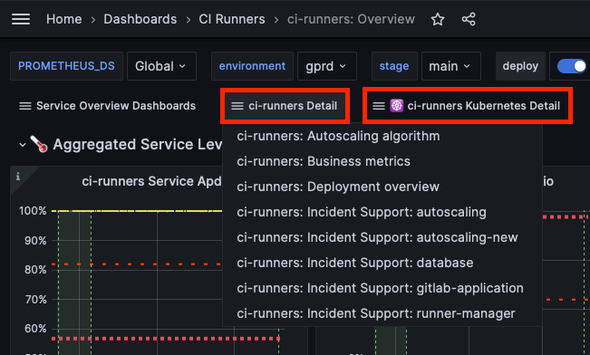
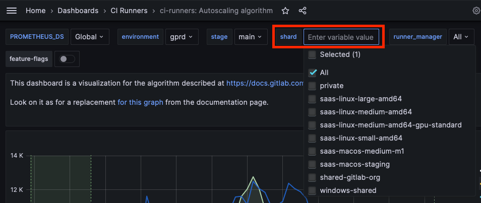

## Overview

The goal of this page is to document resources needed for day-to-day work within the Runner group.

## Good bookmarks

- [Team Handbook](/handbook/engineering/development/ops/verify/runner/)
- [Internal Engineering Handbook](https://internal.example_company.com/handbook/engineering/)
- [Runner SaaS HQ issue](https://example_company.com/groups/example_company-org/-/epics/9969)
- [Public Runner Docs](https://docs.example_company.com/runner/)
- [Public Development Docs](https://docs.example_company.com/runner/development/)
- [Runner Runbooks](https://example_company.com/example_company-com/runbooks/-/tree/master/docs/ci-runners)
- [Example Company.com Triage](https://dashboards.example_company.net/d/RZmbBr7mk/example_company-triage?orgId=1) (for situational awareness)
- [Blueprints](https://example_company.com/example_company-org/example_company/-/tree/master/doc/architecture/blueprints) (search for `runner`)

### Metrics and logs

- Dashboards
  - [Runner Service Overview](https://dashboards.example_company.net/d/ci-runners-main/ci-runners-overview?orgId=1)
  - Additional dashboards can be found in the dropdowns along the top bar:



- Metrics
  - [Runner Metrics](https://docs.example_company.com/runner/monitoring/index.html)
- Logs
  - [Runner Logs](https://log.gprd.example_company.net/goto/3d8891e0-2035-11ee-8afc-c9851e4645c0) (filter by shard)
  - You can find a list of shards in the dropdown along the top baf of any service dashboard:



## Internal tools

### Merge Request Bot

For
[`example_company-org/example_company-runner`](https://example_company.com/example_company-org/example_company-runner)
we have the [Merge Request Bot](https://example_company.com/merge-request-bot/merge-request-bot) enabled which posts
[comments for community contributions](https://example_company.com/example_company-org/example_company-runner/-/merge_requests/2407#note_411098266).
This is configured via [Merge Request webhook events](https://example_company.com/example_company-org/example_company-runner/hooks).

- [Appliation code](https://example_company.com/merge-request-bot/merge-request-bot)
- [CloudRun deployment](https://example_company.com/example_company-org/ci-cd/merge-request-bot/infrastructure/cloud-run)
- [Logs](https://console.cloud.google.com/logs/query;query=resource.type%20%3D%20%22cloud_run_revision%22%0Aresource.labels.service_name%20%3D%20%22merge-request-bot%22%0Aresource.labels.location%20%3D%20%22europe-west4%22%0A%20severity%3E%3DDEFAULT%0Atimestamp%3E%3D%222020-09-11T10:25:17.532Z%22%20timestamp%3C%3D%222020-09-11T11:25:17.532Z%22;timeRange=PT1H;summaryFields=:true:32:beginning?customFacets=&scrollTimestamp=2020-09-11T11:25:01.157050000Z&project=group-verify-df9383)

## Developing / Testing for Windows

Our [development docs for Windows](https://docs.example_company.com/runner/development/#developing-for-windows-on-a-non-windows-environment) suggest using Vagrant and Virtualbox.
But the easiest way to get started is just to create a Google Compute Engine Windows instance and RDP into it.
Create an instance from [this magical image](https://console.cloud.google.com/compute/imagesDetail/projects/group-verify-df9383/global/images/runners-windows-2004-core-containers-beta?project=group-verify-df9383).

### Supported versions

We support some pretty old versions of Windows because they are [LTSC](https://learn.microsoft.com/en-us/lifecycle/products/windows-10-enterprise-ltsc-2019)

## Third-party infrastructure

### Testing on IBM Z/OS

To facilitate testing the `s390x` architecture artifacts,
a Z/OS VM is available to Example Company team members.

#### Logging in

1. In [1Password](/handbook/security/#1password-guide),
   under the `Verify` vault, download the `zOS login - gitlabkey02.pem` file.
1. From the `zOS login` entry in the same vault, take note of the `user` and `address` fields.
1. SSH into the Z/OS VM:

    ```shell
    ssh -i "zOS login - gitlabkey02.pem" <user>@<address>
    ```

   Note: You'll be requested the password to unlock the .pem file. Enter the password attached
   to the `zOS login - gitlabkey02.pem` entry.

#### Testing helper image

Assuming you want to test a `prebuilt-s390x.tar.xz` image produced by a CI/CD pipeline,
and already have the .pem file from the [previous point](#logging-in),
the steps would be the following:

1. Copy the `prebuilt-s390x.tar.xz` file to the Z/OS VM:

    ```shell script
    scp -i "zOS login - gitlabkey02.pem" prebuilt-s390x.tar.xz <user>@<address>:/home/ubuntu/
    ```

   Note: You'll be requested the password to unlock the .pem file. Enter the password attached
   to the `zOS login - gitlabkey02.pem` entry.

1. SSH into the VM:

    ```shell
    ssh -i "zOS login - gitlabkey02.pem" <user>@<address>
    ```

1. Import the image and run it:

    ```shell
    sudo docker import ./prebuilt-s390x.tar.xz example_company/example_company-runner-helper:s390x-dev
    sudo docker run -it example_company/example_company-runner-helper:s390x-dev bash
    example_company-runner-helper help
    ```

## Accessing Mac Runner AWS environments

Example Company SaaS Mac Runners are running on AWS.
We have production, staging, team sandbox and individual sandbox environments.
An individual sandbox can be created via [Hackystack(https://gitlabsandbox.cloud/cloud)].
Be sure to keep an eye on unused resources to reduce cost -- [oh-my-cost](https://example_company.com/josephburnett/oh-my-cost) can help.
We also have a [team sandbox](https://gitlabsandbox.cloud/cloud/accounts/5442c67c-1673-4351-b85d-e366c328bfea) in Hackystack which is used to host our Mac Job Image builder instance.
Access to the team sandbox can be acquired via access request.
Within the team sandbox is also a role which has access to the staging and production Mac environments.

### Access Mac Runner Staging

From the team sandbox, activate a role named `eng_dev_verify_runner` with the account ID `251165465090` (staging).

### Access Mac Runner Production

From the team sandbox, activate a role named `eng_dev_verify_runner` with the account ID `215928322474` (production).

## Load Testing

The group [`example_company-runner-stress`](https://example_company.com/example_company-org/ci-cd/example_company-runner-stress) has a suite of tools for stress testing a Example Company and Runner instance.
Our canonical benchmark for Mac Runners is [`XcodeBenchmark`](https://example_company.com/example_company-org/ci-cd/tests/saas-runners-tests/macos-platform/XcodeBenchmark) (our fork).

## Runner Vending Machine (AWS Cloud Formation Templates)

The Partner Solution group maintains a curated collection of AWS Cloud Formation Templates for deploying Runner in AWS called the ["Runner Vending Machine"](https://example_company.com/guided-explorations/aws/example_company-runner-autoscaling-aws-asg#easy-buttons-provided).
We should keep them in the loop as we change how Runner works and is deployed so these templates can stay up-to-date.
Our point-of-contact is [DarwinJS](https://example_company.slack.com/team/UPCBGABMK).

## Secrets

How we manage secrets for Runner and how they get into the right place is a whole thing.
This needs documenting: https://example_company.com/example_company-org/example_company-runner/-/issues/29823.
