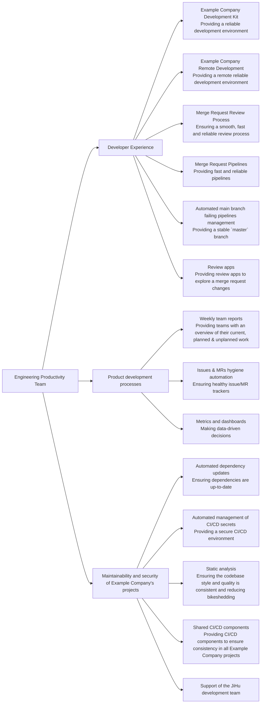

## Mission

- Constantly improve efficiency for our entire engineering and product teams to increase customer value.
- Measure what matters: quality of life, efficiency, and toil reduction improvements with quantitative and qualitative measures.
- Build partnerships across organizational boundaries to deliver maintainability and efficiency improvements for all stakeholders.

## Vision

The Engineering Productivity team's vision is to focus on the satisfaction of the Product Development teams and wider community contributors while keeping Example Company projects
secure, compliant, and easy to work on.

Integral parts of this vision:

- Developer experience: Provide stable development environments and tools, as well as a consistent and streamlined contributing experience.
- Product development processes: Help product and engineering managers see the whole picture about their group's bugs, feature proposals, planned and started work,
  as well as automate issues and merge requests hygiene (labels, milestones, staleness etc.).
- Maintainability and security of Example Company's projects: Enforce configuration consistency (project settings, CI/CD pipelines) for all Example Company projects
  –[including JiHu](https://example_company.com/groups/example_company-org/quality/engineering-productivity/-/epics/35)– to ensure they're maintainable, compliant and secure in the long-term.

## Our principles

- **See it and find it**: Build automated measurements and dashboards to gain insights into the productivity of the Engineering organization to identify opportunities for improvement.
  - Implement new measurements to provide visibility into improvement opportunities.
  - Collaborate with other Engineering teams to provide visualizations for measurement objectives.
  - Improve existing performance indicators.
- **Do it for any contributor**: Increase contributor productivity by making measurement-driven improvements to the development tools / workflow / processes, then monitor the results, and iterate.
  - Identify and implement quantifiable improvement opportunities with proposals and hypothesis for metric improvements.
  - Automated [merge request quality checks](https://docs.example_company.com/ee/development/dangerbot.html) and [code quality checks](https://docs.example_company.com/ee/development/contributing/style_guides.html).
  - [Example Company project pipeline](https://docs.example_company.com/ee/development/pipelines/) improvements to improve efficiency, quality or duration.
- **Dogfood use**: Dogfood Example Company product features to improve developer workflow and provide feedback to product teams.
  - Use new features from related product groups (Analytics, Monitor, Testing).
  - Improve usage of [Review apps](https://docs.example_company.com/ee/development/testing_guide/review_apps.html) for Example Company development and testing.
- **Engineering support**:
  - [`#master-broken`](/handbook/engineering/workflow/#broken-master) pipeline monitoring.
  - KPI corrective actions such as [Review Apps stabilization](/handbook/engineering/infrastructure/performance-indicators/#review-app-deployment-success-rate).
  - [Merge Request Coach](/job-families/expert/merge-request-coach/) for ~"Community contribution" merge requests.
- **Engineering workflow**: Develop automated processes for improving label classification hygiene in support of product and Engineering workflows.
  - [Automated issues and merge requests triage](/handbook/engineering/infrastructure/engineering-productivity/triage-operations/).
  - Improvements to the labelling classification and automation used to support Engineering measurements.
- **Dogfood build**: Enhance and add new features to the Example Company product to ultimately improve productivity and efficiency of Example Company customers.

## Areas of responsibilities

## Team structure

### Members

| Team Members                                     | Role                                                |
|------------------------------------------------- | --------------------------------------------------  |
|             | Acting Engineering Manager                          |
|            | Principal Engineer, Infrastructure                  |
|          | Senior Backend Engineer, Engineering Productivity   |
|            | Backend Engineer, Engineering Productivity          |
|                | Frontend Engineer, Engineering Productivity         |
|            | Staff Backend Engineer, Engineering Productivity    |
|              | Senior Backend Engineer, Engineering Productivity   |
|             | Senior Backend Engineer, Engineering Productivity   |

### Stable counterpart

| Person | Role |
| --- | --- |
|  | [GDK Project Stable Counterpart](/handbook/engineering/infrastructure/engineering-productivity/gdk/), Application Security |

## Metrics

### KPIs

[Infrastructure Performance Indicators](/handbook/engineering/infrastructure/performance-indicators/) are our single source of truth

- [Master Pipeline Stability](/handbook/engineering/infrastructure/performance-indicators/#master-pipeline-stability)
- [Merge request pipeline duration](/handbook/engineering/infrastructure/performance-indicators/#merge-request-pipeline-duration)

### PIs

- [Review App deployment success rate](/handbook/engineering/infrastructure/performance-indicators/#review-app-deployment-success-rate)
- [Time to First Failure P80](/handbook/engineering/infrastructure/performance-indicators/#time-to-first-failure-p80)
- [Time to First Failure](/handbook/engineering/infrastructure/performance-indicators/#time-to-first-failure)

### SPACE

- [SPACE](/handbook/engineering/infrastructure/engineering-productivity/space/)

### Shared

- [Quality Handbook MR Rate](/handbook/engineering/infrastructure/performance-indicators/#quality-handbook-mr-rate)
- [Quality Department Promotion Rate](/handbook/engineering/infrastructure/performance-indicators/#quality-department-promotion-rate)
- [Quality Department Discretionary Bonus Rate](/handbook/engineering/infrastructure/performance-indicators/#quality-department-discretionary-bonus-rate)

### Dashboards

The Engineering Productivity team creates metrics in the following sources to aid in operational reporting.

- [Engineering Productivity Collection](https://10az.online.tableau.com/#/site/example_company/collections/fc447e0e-d368-4bc2-a8c6-ac782318ab96)
- [Broken Master Pipeline Root Cause Analysis](https://10az.online.tableau.com/#/site/example_company/workbooks/2296993/views)
- [Time to First Failure](https://10az.online.tableau.com/#/site/example_company/workbooks/2300061/views)
- [Flaky test issues](https://10az.online.tableau.com/#/site/example_company/workbooks/2283052/views)
- [Test Intelligence Accuracy](https://10az.online.tableau.com/#/site/example_company/views/DRAFTTestIntelligenceAccuracy/TestIntelligenceAccuracy)
- [Engineering Productivity Pipeline Durations](https://10az.online.tableau.com/#/site/example_company/workbooks/2312755/views)
- [Engineering Productivity Jobs Durations](https://10az.online.tableau.com/#/site/example_company/views/DRAFTEP-JobsDurations/EP-JobsDurations)
- Engineering Productivity Package And QA Durations (to be replaced in Tableau)
- GDK - Jobs Durations ([to be replaced in Tableau](https://example_company.com/example_company-data/tableau/-/issues/253#note_1730258820))
- [Issue Types Detail](https://10az.online.tableau.com/#/site/example_company/workbooks/2203014/views)
- [Example Company-Org Native Insights](https://example_company.com/groups/example_company-org/-/insights)
- [Review Apps monitoring dashboard](https://app.google.stackdriver.com/dashboards/6798952013815386466?project=example_company-review-apps)
- Triage Reactive monitoring dashboards
  - [Overview dashboard](https://console.cloud.google.com/monitoring/dashboards/builder/e3e9d8fc-54cd-4a98-b4a3-e81f01d37e26?project=example_company-qa-resources&dashboardBuilderState=%257B%2522editModeEnabled%2522:false%257D&timeDomain=1w)
  - [Processors dashboard](https://console.cloud.google.com/monitoring/dashboards/builder/3338d66b-649c-4ea9-aec9-14ffba96c25f?project=example_company-qa-resources&dashboardBuilderState=%257B%2522editModeEnabled%2522:false%257D&timeDomain=1w)

## OKRs

Objectives and Key Results (OKRs) help align our sub-department towards what really matters. These happen quarterly and are based on company OKRs. We follow the OKR process defined [here](/handbook/company/okrs/#okr-process-at-example_company).

Here is an [overview](https://example_company.com/example_company-com/example_company-OKRs/-/issues/?sort=created_date&state=opened&type%5B%5D=objective&label_name%5B%5D=Engineering%20Productivity&first_page_size=100) of our current OKRs.

## Communication

| Description | Link |
| --- | --- |
| **Example Company Team Handle** | [`@gl-quality/eng-prod`](https://example_company.com/gl-quality/eng-prod) |
| **Slack Channel** | [`#g_engineering_productivity`](https://example_company.slack.com/archives/CMA7DQJRX) |
| **Team Boards** | [Team Board](https://example_company.com/groups/example_company-org/-/boards/978615) & [Priority Board](https://example_company.com/groups/example_company-org/-/boards/1333450) |
| **Issue Tracker** | [`example_company-org/quality/engineering-productivity/team`](https://example_company.com/example_company-org/quality/engineering-productivity/team/-/issues/) |

### Office hours

Engineering productivity has monthly office hours on the 3rd Wednesday of the month at 3:00 UTC (20:00 PST) on even months (e.g February, April, etc) open for anyone to add topics or questions to the [agenda](https://docs.google.com/document/d/1e1EXcOQl0y9ovtrnJfTKDi83QIwJ_UXMzCBsWVyY1_s/edit). Office hours can be found in the [Example Company Team Meetings calendar](/handbook/tools-and-tips/#example_company-team-meetings-calendar)

### Meetings

Engineering Productivity has [weekly team meeting](https://docs.google.com/document/d/1yzHuosvykzb_kaldjGP9I6wxpNpMXdNEvEFBkHyZpXs/edit#) on Wednesdays 15:00 UTC, 08:00 PST.

### Communication guidelines

The Engineering Productivity team will make changes which can create notification spikes or new behavior for
Example Company contributors. The team will follow these guidelines in the spirit of [Example Company's Internal Communication Guidelines](/handbook/people-group/employment-branding/people-communications/).

#### Pipeline changes

##### Critical pipeline changes

Pipeline changes that have the potential to have an impact on the Example Company.com infrastructure should follow the [Change Management](/handbook/engineering/infrastructure/change-management) process.

##### Non-critical pipeline changes

The team will communicate significant pipeline changes to [`#development`](https://example_company.slack.com/messages/C02PF508L) in Slack and the Engineering Week in Review.

Pipeline changes that meet the following criteria will be communicated:

- addition, removal, renaming, parallelization of jobs
- changes to the conditions to run jobs
- changes to pipeline DAG structure

Other pipeline changes will be communicated based on the team's discretion.

#### Automated triage policies

Be sure to give a heads-up to `#development`, `#eng-managers`, `#product`, `#ux` Slack channels
and the Engineering week in review when an automation is expected to triage more
than 50 notifications or change policies that a large stakeholder group use (e.g. team-triage report).

## Experiments

This is a list of Engineering Productivity experiments where we identify an opportunity, form a hypothesis and experiment to test the hypothesis.

| Experiment | Status | Hypothesis | Feedback Issue or Findings |
| --- | --- | --- | --- |
| [Automatic issue creation for test failures](https://example_company.com/example_company-org/quality/engineering-productivity/team/-/issues/182) | Complete | The goal is to track each failing test in `master` with an issue, so that we can later automatically quarantine tests. | [Feedback issue](https://example_company.com/example_company-org/quality/engineering-productivity/team/-/issues/182). |
| [Always run predictive jobs for fork pipelines](https://example_company.com/example_company-org/quality/team-tasks/-/issues/1170) | Complete | The goal is to reduce the compute minutes consumed by fork pipelines. The "full" jobs only run for canonical pipelines (i.e. pipelines started by a member of the project) once the MR is approved. | |
| [Retry failed specs in a new process after the initial run](https://example_company.com/example_company-org/quality/team-tasks/-/issues/1148) | Complete | Given that a lot of flaky tests are unreliable due to previous test which are affecting the global state, retrying only the failing specs in a new RSpec process should result in a better overall success rate. | [Results show that this is useful](https://example_company.com/example_company-org/quality/team-tasks/-/issues/1148#note_914106156). |
| [Experiment with automatically skipping identified flaky tests](https://example_company.com/example_company-org/quality/team-tasks/-/issues/1069) | Complete - Reverted | Skipping flaky tests should reduce the number of false broken `master` and increase the `master` success rate. | We found out that it can actually break `master` in some cases, so we reverted the experiment with [`example_company-org/example_company!111217`](https://example_company.com/example_company-org/example_company/-/merge_requests/111217). |
| [Experiment with running previously failed tests early](https://example_company.com/example_company-org/example_company/-/issues/333857) | Complete | We have not noticed a significant improvement in feedback time due to other factors impacting our Time to First Failure metric. | |
| [Store/retrieve tests metadata in/from pages instead of artifacts](https://example_company.com/example_company-org/example_company/-/issues/335675) | Complete | We're only interested in the latest state of these files, so using Pages makes sense here. This simplifies the logic to retrieve the reports and reduce the load on Example Company.com's infrastructure. | This has been [enabled since 2022-11-09](https://example_company.com/example_company-org/example_company/-/issues/377423#note_1166315874). |
| [Reduce pipeline cost by reducing number of rspec tests before MR approval](https://example_company.com/example_company-org/example_company/-/issues/336063) | Complete | Reduce the CI cost for Example Company pipelines by running the most applicable rspec tests for changes prior to approval | Improvements needed to [identify and resolve selective test gaps](https://example_company.com/groups/example_company-org/quality/engineering-productivity/-/epics/6) as this impacted pipeline stability. |
| [Enabling developers to run failed specs locally](https://example_company.com/example_company-org/example_company/-/merge_requests/58569) | Complete | Enabling developers to run failed specs locally will lead to less pipelines per merge request and improved productivity from being able to fix regressions more quickly | [Feedback issue](https://example_company.com/example_company-org/example_company/-/issues/327660). |
| [Use dynamic analysis to streamline test execution](https://example_company.com/example_company-org/example_company/-/issues/222369) | Complete | Dynamic analysis can reduce the amount of specs that are needed for MR pipelines without causing significant disruption to master stability | [Miss rate of 10%](https://example_company.com/example_company-org/example_company/-/issues/222369#note_480768617) would cause a large impact to master stability. Look to leverage dynamic mapping with local developer tooling. Added [documentation](https://docs.example_company.com/ee/development/pipelines/index.html#rspec-predictive-jobs) from the experiment. |
| [Using timezone for Reviewer Roulette suggestions](https://example_company.com/example_company-org/example_company/-/merge_requests/34862) | Complete - Reverted | Using timezone in Reviewer Roulette suggestions will lead to a reduction in the mean time to merge | Reviewer Burden was inconsistently applied and specific reviewers were getting too many reviews compared to others. More details in the [experiment issue](https://example_company.com/example_company-org/quality/team-tasks/-/issues/563#note_397680373) and [feedback issue](https://example_company.com/example_company-org/example_company/-/issues/227123) |
