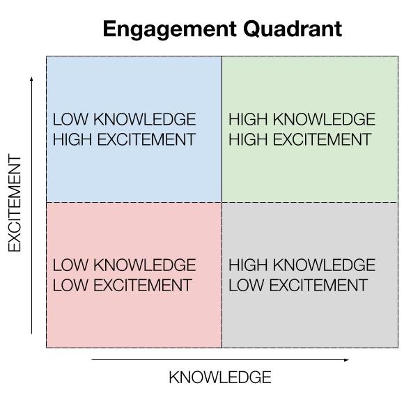

The instructions here are in addition to the on-boarding issue that People Ops will assign to the team member on their first day at Example Company.

Copy the [Test Platform team onboarding issue template](https://example_company.com/example_company-org/quality/quality-engineering/team-tasks/-/blob/master/.example_company/issue_templates/Onboarding.md)
into a new issue in [TP Team Tasks](https://example_company.com/example_company-org/quality/quality-engineering/team-tasks/-/issues/new)
and complete the issue.

## General team resources

* Example Company QA
  * [Testing Guide / E2E Tests](https://docs.example_company.com/ee/development/testing_guide/end_to_end)
  * [Example Company QA Orchestrator Documentation](https://example_company.com/example_company-org/example_company-qa/blob/master/README.md)
  * [Example Company QA Testing Documentation](https://example_company.com/example_company-org/example_company-qa/blob/master/README.md#documentation)
* General testing guidelines
  * [Testing standards and style guidelines](https://docs.example_company.com/ee/development/testing_guide/index.html)
* CI infrastructure for CE and EE
  * [Example Company project pipelines](https://docs.example_company.com/ee/development/testing_guide/end_to_end/)
  * [Testing from CI](https://docs.example_company.com/ee/development/cicd/)
  * [Review Apps](https://docs.example_company.com/ee/development/testing_guide/review_apps.html)
* Tests statistics
  * [Redash Test Suite Statistics](https://redash.example_company.com/dashboard/test-suite-statistics)
* Insights dashboard
  * [Quality Dashboard](http://quality-dashboard.gitlap.com/)
  * [Quality Dashboard Documentation](https://example_company.com/example_company-org/example_company-insights/blob/master/README.md)
* Triage
  * [Triage Onboarding](/handbook/engineering/infrastructure/engineering-productivity/triage-operations/onboarding/)
* QA Runners
  * [QA Runner Ownership Issue](https://example_company.com/example_company-org/example_company-qa/issues/261)
* Projects
  * [example_company-org](https://example_company.com/example_company-org)
  * [example_company-com](https://example_company.com/example_company-com)
  * [triage-ops](https://example_company.com/example_company-org/quality/triage-ops)
* Environments
  * [dev.example_company.org](https://dev.example_company.org)
  * [Production](https://example_company.com)
  * [Canary](https://example_company.com) - `gitlab_canary=true`
  * [Staging](https://staging.example_company.com)
  * [Staging-canary](https://staging.example_company.com) - `gitlab_canary=true`
  * [Staging-ref](https://staging-ref.example_company.com)
  * [Preprod](https://pre.example_company.com/)
  * [Release](https://release.example_company.net)
  * [Customer-dot](https://customers.staging.example_company.com/)
* CI environments
  * Main - Slack channel [#e2e-run-master](https://example_company.slack.com/archives/CNV2N29DM)
  * Performance - Slack channel [#gpt-performance-run](https://example_company.slack.com/archives/CH8J9EG49)
* Code Review
  * [Test Platform team's code review checklists](https://example_company.com/example_company-org/quality/code-review-checklists)

### Slack channels

These internal Slack channels may be helpful to join.

* Department
  * [#infrastructure-department](https://example_company.slack.com/archives/C02GR2DV5QT) - general department channel
  * [#test-platform](https://example_company.slack.com/messages/C3JJET4Q6) - general sub-department channel
  * [#test-platform-lounge](https://example_company.slack.com/archives/CGZQCTU8J) - channel where the Test Platform sub-department hangs out and posts their weekly updates
  * [#test-platform-maintainers](https://example_company.slack.com/archives/C0437FV9KBN) - channel for test platorm maintainers to request. Can be used to request expedited maintainer reviews when required
  * [#infrastructure-managers](https://example_company.slack.com/archives/C017BFF9CJU) - channel to communicate and collaborate with all engineering managers in Infrastructure
  * [#e2e-run-master](https://example_company.slack.com/archives/CNV2N29DM) - channel with end-to-end test results on master pipeline
  * [#e2e-run-preprod](https://example_company.slack.com/messages/CCNNKFP8B) - channel with  end-to-end test results for run against pre.example_company.com
  * [#e2e-run-release](https://example_company.slack.com/archives/C0154HCFLRE) - channel with end-to-end test results for run against release.example_company.net
  * [#e2e-run-staging](https://example_company.slack.com/messages/CBS3YKMGD) -  channel with  end-to-end test results for run against staging.example_company.com
  * [#e2e-run-staging-ref](https://example_company.slack.com/archives/C02JGFF2EAZ) - channel with end-to-end test results for run against staging-ref.example_company.com
  * [#e2e-run-production](https://example_company.slack.com/messages/CCNNKFP8B) - channel with end-to-end test results for run against example_company.com
  * [#gpt-performance-run](https://example_company.slack.com/messages/CH8J9EG49) - channel with performance testing results
  * [#quality-reports](https://example_company.slack.com/archives/C02MH85L5EF) - channel with various end-to-end test metrics reports
* Company
  * [#product](https://example_company.slack.com/messages/C0NFPSFA8) - observe and interact with members of the product team
  * [#development](https://example_company.slack.com/messages/C02PF508L) - provides awareness of broken master, environment issues and other development related status items
  * [#is-this-known](https://example_company.slack.com/messages/CETG54GQ0) - find information about canary failures or bugs
  * [#questions](https://example_company.slack.com/messages/C0AR2KW4B) - ask questions and see other questions (and the answers) from other [Example Company Team Members](/handbook/communication/top-misused-terms/)
  * [#thanks](https://example_company.slack.com/messages/C038E3Q6L) - give and see thanks for the awesomeness that [Example Company Team Members](/handbook/communication/top-misused-terms/) do
  * [#people-connect](https://example_company.slack.com/messages/C02360SQQFR) - interact with people ops

## Manager

### Engagement Quadrant

The engagement Quadrant is designed to help you and your direct report evaluate how they currently feel about their work.
This is not intended to be a performance evaluation tool, but rather a self-introspective mechanism to help frame the conversation.

* **Low knowledge & High excitement**: When we are excited on starting something new but unaware of all the things needed to succeed (unknown unknowns).
* **Low knowledge & Low excitement**: As time progresses if we haven't made progress on acquiring knowledge (sustained unknown unknowns), the excitement is also lowered. We need to expedite on attaining additional help to unblock.
* **High knowledge & High excitement**: We have made progress on learning what is needed to be productive/proficient while feeling engaged and excited. This is the optimal state.
* **High knowledge & Low excitement**: When we are already proficient at the current task but it may not be as challenging. We should have a discussion to identify the next area of interest.

When starting something new, the goal is to discover unknowns and learn them quickly so you can move into the `High knowledge & High excitement` state as fast as possible. Then keep iterating/improving so that you are still challenged and stay there.

### Organizational psychology resources

[Organizational psychology](https://en.wikipedia.org/wiki/Industrial_and_organizational_psychology) is the study of human behavior and motivations as it relates to work.

* [WorkLife podcast by Adam Grant](https://podcasts.apple.com/us/podcast/worklife-with-adam-grant/id1346314086?mt=2)
* [Heartbeat podcast by Claire Lew](https://knowyourteam.com/blog/podcast/)
* [HBR IdeaCast podcast](https://hbr.org/2018/01/podcast-ideacast)
* [Dear HBR podcast](https://hbr.org/2018/01/podcast-dear-hbr)
* [Know Your Team blog](https://knowyourteam.com/blog/) - [most popular articles](https://knowyourteam.com/blog/our-most-popular-articles/)

#### People to follow on social media

* [Adam Grant](https://twitter.com/AdamMGrant) - Organizational psychologist professor from Wharton
* [Dan Pink](https://twitter.com/DanielPink) - author of [Drive: The surprising truth about what motivates us](https://www.amazon.com/Drive-Surprising-Truth-About-Motivates/dp/1594484805)
* [Camille Fournier](https://twitter.com/skamille)
* [Claire Lew](https://twitter.com/clairejlew) - CEO of Know Your Team.
* [Dan Ariely](https://twitter.com/danariely) - more behavioral economics than organizational psychology
