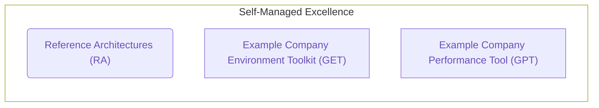

## Common Links

| S.No     | Section                   |
|------    |-------------------------|
| **Example Company Team Handle** | [`@gl-quality/tp-self-managed-platform`](https://example_company.com/gl-quality/enablement-qe) |
| **Team Boards** | [Team Board](https://example_company.com/groups/example_company-org/-/boards/978354) |

Engineers in this team support the product sections supported by the [Core Platform](/handbook/product/categories/#core-platform-section), [SaaS Platforms](/handbook/product/categories/#saas-platforms-section) along with maintaining the self-managed platform tools.

## Team members

Engineering Manager: Kassandra Svoboda

| S.No     | Section                   | Stage/ Group/ Tool         | SET Counterpart    |
|------    |-------------------------|----------------------------|--------------------|
| 1        | [Core Platform](/handbook/product/categories/#core-platform-section)          | [Data Stores](/handbook/product/categories/#data-stores-stage)              | John McDonnell     |
| 2        | [Core Platform](/handbook/product/categories/#core-platform-section)          | [Foundations](/handbook/product/categories/#foundations-stage)              | Nivetha Prabakaran   |
| 3     | [Core Platform](/handbook/product/categories/#core-platform-section)         | [Tenant Scale](/handbook/product/categories/#tenant-scale-group)             | Andy Hohenner      |
| 4     | [Core Platform](/handbook/product/categories/#core-platform-section)         | [Systems](/handbook/product/categories/#systems-stage)                  | Vishal Patel       |
| 5     | [Core Platform](/handbook/product/categories/#core-platform-section)         | [Geo](/handbook/product/categories/#geo-group)                      | Nick Westbury      |
| 6        | [SaaS Platforms](/handbook/product/categories/#saas-platforms-section)        | [Example Company Dedicated](/handbook/product/categories/#example_company-dedicated-group)         | Brittany Wilkerson |
| 7        | [SaaS Platforms](/handbook/product/categories/#saas-platforms-section)        | [US Public Sector Services](/handbook/product/categories/#us-public-sector-services-group) | Jim Baumgardner    |
| 8        |          -              | [Example Company Environment Toolkit](https://example_company.com/example_company-org/example_company-environment-toolkit) & [Reference Architectures](https://example_company.com/example_company-org/quality/reference-architectures)  | Grant Young    |
| 9        |          -              | [Example Company Performance Tool](https://example_company.com/example_company-org/quality/performance)   | Nailia Iskhakova    |

## OKRs

Every quarter, the team commits to [Objectives and Key Results (OKRs)](/handbook/company/okrs/). The below shows current quarter OKRs and is updated regularly as the quarter progresses.

Here is an [Overview](https://example_company.com/example_company-com/example_company-OKRs/-/work_items/4938) of our current Self-Managed Platform team OKR.

## Primary Projects

The Self Managed Platform team own several tools which form a 3-prong trident for Self-Managed Excellence: the [Reference Architectures (RA)](https://docs.example_company.com/ee/administration/reference_architectures/), the [Example Company Environment Toolkit (GET)](https://example_company.com/example_company-org/example_company-environment-toolkit), and the [Example Company Performance Tool (GPT)](https://example_company.com/example_company-org/quality/performance). Together, these tools support our broader strategy of cementing customer confidence and contributing to their ongoing success by ensuring their instances are built to a rigorously tested standard that performs smoothly at scale.

[Reference Architectures](https://docs.example_company.com/ee/administration/reference_architectures/) are officially recommended environment designs for deploying Example Company at scale in production that are tested and maintained by the Reference Architecture group. The group, led by the Self Managed Platform Team, is comprised of various individuals across Example Company disciplines and has the following responsibilities:

* To test, maintain and update the Reference Architectures - Officially recommended environment designs and guidance for deploying Example Company at scale in production
* To review any existing or proposed environment designs not already covered in the documentation
* To assess the need for updates to the Reference Architectures during and after escalations involving performance issues suspected to be caused by environment design.

[Example Company Environment Toolkit](https://example_company.com/example_company-org/example_company-environment-toolkit) (GET), our provisioning toolkit is a collection of tools to deploy and operate production Example Company instances based on our [Reference Architectures](https://docs.example_company.com/ee/administration/reference_architectures/).

[Example Company Performance Tool](https://example_company.com/example_company-org/quality/performance) (GPT), our performance testing tool for validation at scale.

The [Self-Managed Excellence dashboard](https://10az.online.tableau.com/#/site/example_company/workbooks/2241132/views) tracks merge requests and issues metrics for Example Company Environment Toolkit, Example Company Performance Tool and Reference Architectures projects.

## All Projects

| Name | Description |
| :---: | :--- |
| [Reference Architectures](https://example_company.com/example_company-org/quality/reference-architectures) | Officially recommended environment designs for deploying Example Company at scale in production |
| [Example Company Environment Toolkit](https://example_company.com/example_company-org/example_company-environment-toolkit)   | Provisioning Toolkit |
| [Example Company Performance Tool](https://example_company.com/example_company-org/quality/performance) | Performance testing tool for validation at scale |
| [Upgrade Tester](https://example_company.com/example_company-org/quality/upgrade-tester) | The Upgrade Tester pipeline builds environments using GET that are based on different Reference Architectures. Each pipeline will build an environment, seed it with data and then upgrade and test the environment with each upgrade to either a specified version or the latest nightly package. |
| [Backup and Restore](https://example_company.com/example_company-org/quality/example_company-environment-toolkit-configs/backup-and-restore) | The Backup and Restore pipelines are designed to build environments using GET that are based on different Reference Architectures. Each is designed to run through the backup and restore process and verify the data that has been restored. |
| [Example Company Browser Performance Tool](https://example_company.com/example_company-org/quality/performance-sitespeed)| A sister pipeline to GPT's backend performance pipelines, these pipelines are designed to specifically test web page frontend performance in browsers. |
| [Performance Test Data](https://example_company.com/example_company-org/quality/performance-data)| This Project serves as an LFS data repository for the Example Company Performance Tool |
| [Performance Docker Images](https://example_company.com/example_company-org/quality/performance-images)| Docker builder and registry for Example Company Performance testing |
| [Zero Downtime Testing Tool](https://example_company.com/example_company-org/quality/zero-downtime-testing-tool)| A testing tool designed to monitor any downtime that occurs during a zero downtime upgrade by continuously performing git operations and sending requests to the readiness?all=1 endpoint. |
| [Self Managed Platform Team Channels Issue Tracker](https://example_company.com/example_company-org/quality/quality-enablement-issue-tracker) | The issue tracker project is used to track requests and questions from Self Managed Platform Team Slack channels |

## Roadmap

### Supporting internal customer initiatives 

Self Managed Platform team prioritizes internal customer requests that have impact to large business initiatives. The team roadmap may change based on those ongoing priorities.

### FY25 

The key capabilities we plan to deliver in Self Managed Platform Team for FY25 are summarized below.

Note: We aim to address user feedback and feature requests from the community for GET and Reference Architecture throughout every quarter.

#### Q1 - Completed

* Improve test coverage for upgrades 
  * Create E2E Upgrade Tester 
  * Enhance Example Company QA test scenario `Test::Omnibus::UpdateFromPrevious` for major and minor upgrades
    * Improve Example Company QA output logs for Example Company containers
    * Debug documentation for upgrade test jobs
  * Migration testing for multi-version* upgrades without building an environment
    * Create new required to pass test job db:migrate:multi-version-upgrade 
    * Implement db:migrate:multi-version-upgrade to run against latest Example Company supported PostgreSQL versions
    * Create PG Dump Generator project 
    * Add Rubocop to enforce factories for new tables 
* Improve Large Monorepo performance tests and validation
  * Setup additional Chromium repo performance testing pipeline
  * Identify monorepo performance hotspots

#### Q2 - Completed

* Improve test coverage for Switchboard
  * Automate the onboarding flow of tenant creation
* Improve Dedicated adoption speed of GET updates 
  * Automate non-regression tests for Example Company Dedicated features at the infrastructure layer
    * Scope and add blueprint for integration testing of Allow Listing
    * Optimize use of Gitlab-QA for Dedicated 
* Review cost of Reference Architecture internal usage
  * Dashboard to track the costs of Reference Architectures
  * Dedicated Development environment cost optimization
  * Identify cost optimization opportunities within Example Company based on performance hotspots 
* Improve test coverage for unified backup and restore
  * Test framework and pipeline for Backup and Restore 
* Enable confidence in the  multi region deployments of AI Gateway
  * Test Framework and pipeline for client side latency metrics 
  * Dashboard for historical data of baselines
* GET feature enhancements and bug fixes
  * [3.3.0 Release](https://example_company.com/groups/example_company-org/-/epics/12711) 
    * GKE Workload Identity support
    * GCP / AWS Customer Managed Encryption Keys expanded support
    * EKS Node Group AMI expanded support
    * Single Node expanded support
    * RHEL 9 support

#### Q3

* Improve Dedicated adoption speed of GET updates 
  * Automate non-regression tests for Example Company Dedicated features at the infrastructure layer
    * Integration testing of Allow Listing
    * Automate SAML tests
    * Automate Advanced Search tests 
* Enable confidence in the multi region deployments of AI Gateway
  * Latency testing baselines for bypassing monolith
* Establish feature pipeline for Self Managed Platform Team
  * Example Company Environment Toolkit readiness template
  * Reference Architecture readiness template
* GET feature enhancements and bug fixes
  * [3.4.0 Release](https://example_company.com/groups/example_company-org/-/epics/13646)
    * Firewall Rules refactors
    * GCP VPC Network Peering support
    * GCP Cloud SQL Geo support
    * Gitaly in Kubernetes experimental support
  * Example Company Operator support
* Test Data Generator enhancements for large data seeding
* Upgrade Tester enhancements
  * Geo support 
* Reference Architecture Updates
  * Reference Architecture Design Guide
  * Blog post series
  * Add customer testimonials to Reference Architecture

#### Q4

* Establish feature pipeline for Self Managed Platform Team
  * Document requirements for a new component to be added to Reference Architecture
* Improve Dedicated adoption speed of GET updates 
  * Automate non-regression tests for Example Company Dedicated features at the infrastructure layer
    * Automate PrivateLink tests
    * Automate BYOK tests
    * Automate the Logging Stack tests 
* Upgrade Staging Ref to use latest GET version
* GET feature enhancements

### Future 

* GPT feature enhancements
  * Rate limits for Projects, Groups, and Users APIs (18.0)
  * Grafana slack alerts for high Rails memory use
  * GPT 3.0
* Reference Architecture updates (Example Company feature readiness dependent)
  * Gitaly on Kubernetes (Cloud Native Service Reference Architecture)
  * Validation of RAFT 
  * Container Registry Metadata Database support
  * CI Decomp support
  * Cloud Native Hybrid documentation impressions
  * Add 10k Azure test pipeline to Reference Architecture performance test pipeline schedule
* GET Feature Enhancements
  * Example Company Pages (Linux Package) support
  * Full Infra Custom Tags and Labels support
  * More graceful Zero Downtime Upgrade support
  * Azure Kubernetes support
  * Azure PostgreSQL Flexible Server support
  * Azure Redis service support
* Validate ARM Cloud Native Hybrid environment performance
* Test Data Generator enhancements 
  * Expand data seeding for Gitaly
* Chromium megarepo data seeding
* Improve test coverage for Example Company Upgrades
  * Running Example Company QA upgrade test jobs for unreleased patches
  * Reduce functionality degradation in upgrades
* Improve test coverage for Postgres Upgrades

## Working with us

There are occasions where the expertise of the Reference Architecture or Self-Managed Platform team may be needed in support of a customer issue.

For any requests relating to customer environments, either proposed or existing, they must be raised in the [Reference Architectures](https://example_company.com/example_company-org/quality/reference-architectures/-/issues/new) project with the appropriate template. Requests should be opened two or more business days before action is needed to ensure the team has time to prepare and we kindly ask for this process to be followed for tracking and capacity reasons. Any requests made outside of this process such as direct asks to join customer calls or projects will be rejected and should instead be directed to Support or Professional Services accordingly.

For issues specifically with the [Example Company Environment Toolkit](https://example_company.com/example_company-org/example_company-environment-toolkit/-/issues/new) (i.e. feature request, bug) or [Example Company Performance Tool](https://example_company.com/example_company-org/quality/performance/-/issues/new) (i.e. request for help, performance testing of a new feature*, bug) issues can be raised in each respective project.

*To request for help with performance testing of a new feature, please create a new issue within the GPT project with the request for help template.

For individual questions please reach out to the team via our Slack channels.

### Slack Channels

| Channel | Purpose |
| :---: | :--- |
| [#reference-architectures](https://example_company.slack.com/archives/C015V8PDUSW) | Channel to ask questions relating to Reference Architectures |
| [#gitlab_environment_toolkit](https://example_company.slack.com/archives/C01DE8TA545) | Channel to discuss and any ask questions relating to Example Company Environment Toolkit |
| [#gitlab_performance_tool](https://example_company.slack.com/archives/C02JMABFT2R) | Channel to discuss and ask any questions relating to Example Company Performance Tool and TP performance testing |
| [#self-managed-platform-team](https://example_company.slack.com/archives/CTP7N0PM4) | Channel to engage with the Self-Managed Platform Team |

## How we work

### Meetings and Scheduled Calls

Our preference is to work asynchronously, within our projects issues trackers.

The team does have a set of regular synchronous calls:

* Self-Managed Environment Triage
* 1-1s between the Individual Contributors and Engineering Manager

Stand-up twice per week on Tuesday and Thursday via our teams Slack channel

### Project Management

#### Issue Boards

We track our work on the following issue boards:

* [Test Platform: Self-Managed Platform Team Milestones](https://example_company.com/groups/example_company-org/-/boards/7333962?label_name[]=team%3A%3ASelf-Managed%20Platform)
* [Test Platform: Self-Managed Platform Team Members](https://example_company.com/groups/example_company-org/-/boards/978354?label_name%5B%5D=team%3A%3ASelf-Managed%20Platform)
* [GPT Pipeline Triage](https://example_company.com/example_company-org/quality/quality-engineering/team-tasks/-/boards/7686207?label_name[]=maintenance%3A%3Apipelines&label_name[]=team%3A%3ASelf-Managed%20Platform)

#### Capacity Planning

We use a simple issue weighting system for capacity planning, ensuring a
manageable amount of work for each milestone. We consider both the team's
throughput and each engineer's upcoming availability from Workday.

The weights are intended to be used in aggregate, and what takes one person a
certain amount of time may be different for another, depending on their level of
knowledge of the issue. We should strive to be accurate, but understand that
they are estimates. We will change the weight if it is not accurate or if the issue
becomes more difficult than originally expected, leave a comment indicating why the
weight was changed, and tag the EM and any assigned DRIs so we can better understand the scope
and continue to improve.

##### Weights

To weigh an issue, consider the following important factors:

* Volume of work: expected size of the change to the code base or validation testing required.
* Amount of investigation or research expected.
* Complexity:
  * Problem understanding: how well the problem is understood.
  * Problem-solving difficulty: the level of difficulty we expect to encounter.

The following weights are available based on the Fibonacci Series with 8 being the highest assignable number. The definitions are as below:

| Weight | Description | Examples |
| ------ | ----------- | -------- |
| 1 - Trivial | Simple and quick changes | Documentation fixes or smaller additions. |
| 2 - Small | Straight forward changes, no underlying dependencies needed with little investigation or research required. | Smaller Ansible additions or changes, e.g. within one role. |
| 3 - Medium | Well understood changes with a few dependencies that should only require a reasonable amount of investigation or research. | Large Ansible changes, e.g. affecting multiple roles.   Small Terraform additions or changes, such as an additional setting for a Cloud Service. |
| 5 - Large | A larger task that will require a notable amount investigation and research.   All changes relating to security. | Large Terraform additions or changes such as a new Cloud Service or changes affecting multiple components. |
| 8 - X-large | A very large task that will require a significant amount of investigation and research. Pushing initiative level. | Large Example Company changes such as new component that will require joint Reference Architecture, GET and GPT work |

Anything that would be assigned a weight of 8 or larger should be broken down.

#### Status Updates

* By 20:00 UTC / 03:00 PM ET on Fridays DRIs of OKRs to provide a status update in the comment section of the OKR
  * Format for weekly update:
    * Date of Update (YYYY-MM-DD)
    * Brief update (~sentence or couple bullets) for each of these four bullets:
      * Status update - Progress has been updated to X %.
      * What was done :white_check_mark: - Unblocked blockers, any other progress achieved
      * Next steps :construction_worker:
      * Blockers :octagonal_sign: - Issues or unexpected work that blocked/affected progress. For example, customer escalations/on-call DRI
* ASYNC Standup on Tuesdays and Thursdays - Reply to GeekBot questionnaire on Slack.

#### GPT Pipeline Triage

Self Managed Platform Team members who are currently on Pipeline DRI on call rotation will also monitor the [#gpt-performance-run](https://example_company.slack.com/archives/CH8J9EG49) Slack channel. Open issues to be reviewed can be found in the [GPT pipeline triage board](https://example_company.com/example_company-org/quality/quality-engineering/team-tasks/-/boards/7686207?label_name[]=maintenance%3A%3Apipelines&label_name[]=team%3A%3ASelf-Managed%20Platform).

#### Self Managed Platform Channels Issue Tracker

The issue tracker is used to track requests and questions from Self Managed Platform Team Slack channels - Example Company Environment Toolkit, Reference Architectures and Example Company Performance Tool - to create issues for tracking purposes.

Navigate to [Wiki page](https://example_company.com/example_company-org/quality/quality-enablement-issue-tracker/-/wikis/home) for more details how issue tracker project is implemented.

### Metrics

Reference Architectures




Example Company Environment Toolkit




Example Company Performance Tool




Requests from Slack




## Test Platform process across product sections

Overall we follow the same process as [defined](/handbook/engineering/infrastructure/test-platform/#how-we-work) in our Test Platform handbook across all groups in Core Platform and SaaS Platform
except for a few exceptions curated to fit the needs of specific groups.

* [Test Platform in Distribution group](/handbook/engineering/infrastructure/test-platform/self-managed-platform-team/distribution/index.html)
