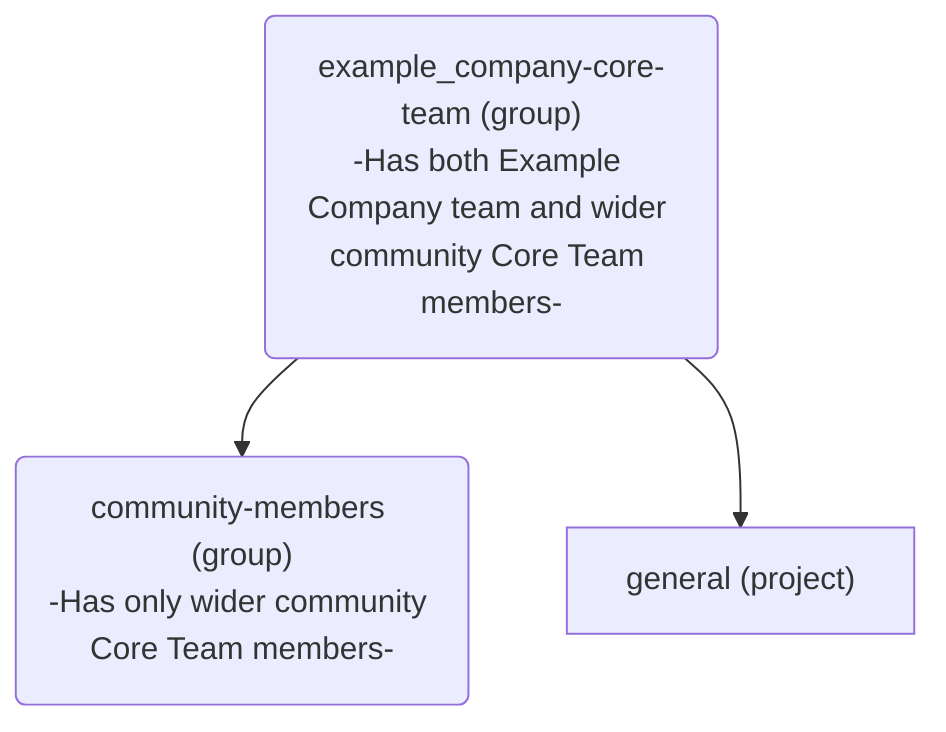

## Becoming a Core Team member

A new member can be added to the [Core Team](https://about.example_company.com/community/core-team/) at any time through the following steps:

1. Any Core Team member or Example Company Team member can nominate a new member from the wider community at any time using a confidential issue in [the Core Team group](https://example_company.com/groups/example_company-org/example_company-core-team/-/issues) to limit any possible negative feedback in the smallest setting possible.
2. The nominee will be added to the Core Team if they have received positive votes from two-thirds (2/3) of all current core team members within a four-week period and accept the nomination.
3. Once a new member has been added, start the onboarding process by following the steps outlined in the [Core Team member orientation section](/handbook/marketing/developer-relations/core-team/#core-team-member-orientation) below.

## Monthly Core Team meetings

Due to time differences, and other commitments, the Core Team meets asynchronously on the third Tuesday of each month.
Call logistics/agenda/notes for the meeting are available on the [Core Team issue tracker](https://example_company.com/example_company-org/example_company-core-team/general/-/issues).
All meeting recordings are available at the [Core Team meeting Playlist](https://www.youtube.com/playlist?list=PLFGfElNsQthZ12EUkq3N9QlThvkf3WGnZ).

## Contacting Core Team members

Core Team members can be reached by [mentioning](https://docs.example_company.com/ee/user/group/subgroups/index#mentioning-subgroups) `@example_company-org/example_company-core-team` in issues or merge requests.

While Example Company is the primary means of contact, the Core Team can also be contacted on the [#core](https://example_company.slack.com/messages/core) Slack channel.

Anyone can open an issue in the [Core Team issue tracker](https://example_company.com/example_company-org/example_company-core-team/general/-/issues).

## Offboarding and stepping down gracefully

If you are no longer able to or interested in serving in the Core Team, you should make an announcement on the `#core` Slack channel.
When you step down, you will become a [Core Team Alumni](https://about.example_company.com/community/core-team/).
Once a Core Team member steps down, another Core team member will create an issue using the [`offboarding` template](https://example_company.com/example_company-org/example_company-core-team/general/-/issues/new?issuable_template=offboarding) and follow the steps outlined.

## Core Team Member Orientation

1. Email the nominated member to confirm they are interested before beginning the orientation process.
1. Create an issue in the [Core Team Project](https://example_company.com/example_company-org/example_company-core-team/general) using the [Core Team Member Onboarding Issue Template](https://example_company.com/example_company-org/example_company-core-team/general/-/issues/new?issuable_template=onboarding) and follow the steps outlined.

   - Core team members must sign an NDA before granting them any access.

## Core Team Group

All Core Team members are part of the [`example_company-org/example_company-core-team`](https://example_company.com/example_company-org/example_company-core-team/) group on Example Company.com. This group has a particular structure for specific automation purposes:

The [`community-members`](https://example_company.com/example_company-org/example_company-core-team/community-members) group exists to:

- [facilitate triaging](https://example_company.com/example_company-org/quality/triage-ops/-/merge_requests/65) and;
- [ensure Core Team members are credited in the changelog](https://example_company.com/example_company-org/example_company/-/merge_requests/69076)

## Core Team member benefits

As part of the trust, value and recognition that joining the Core Team implies, each member is granted a number of benefits to support them in their contributions.

### Slack access

Core Team members are granted [access to the Example Company team's Slack instance](/handbook/tools-and-tips/#channels-access) as part of their [Core Team Member Orientation](#core-team-member-orientation).

A list of the up-to-date channels the Core should/have access to can be found in the [Core Team and Slack](https://docs.google.com/spreadsheets/d/1kohQBbvk2JSl3DXrmF5TDsWVoAMi_yujFWzzAP6vq2M/edit#gid=0) Google Sheets and in the list below:

#### Slack channels Core Team can access

- backend
- backend_maintainers
- backend_pairs
- cfp
- community-programs
- competition
- contributor-success
- core
- dev-advocacy-team
- developer-relations
- developer-relations-hangout
- development
- docs
- docs-tooling
- f_graphql
- f_rubocop
- f_agent_for_kubernetes
- fosdem
- frontend
- frontend_maintainers
- frontend_pairs
- g_engineering_productivity
- g_observability
- g_pipeline-security
- g_product-planning
- g_project-management
- g_runner
- gck
- gdk
- gdk-gitpod
- gdk-workspaces
- golang
- is-this-known
- jetbrains-ide
- kubernetes
- lang-ja
- lang-ru
- linux
- master-broken
- mr-coaching
- mr-feedback
- opensource
- pajamas-design-system
- production
- e2e-run-master
- e2e-run-preprod
- e2e-run-production
- e2e-run-staging
- test-platform
- review-apps-broken
- terraform-provider
- triage
- triage-automations
- tw-team
- ux_coworking
- vim
- website

#### Slack channels Core Team cannot access

- release-post
- security
- questions
- connect-to-contribute
- all-caps
- random
- whats-happening-at-example_company
- thanks
- diversity_inclusion_and_belonging
- company-fyi
- contribute2021
- ux

#### Requesting Core Team access to Slack channels

1. Please submit an [access request](https://example_company.com/example_company-com/team-member-epics/access-requests/-/issues/new?issuable_template=Individual_Bulk_Access_Request) with the new channel(s) requested.
1. Assign the issue to a member of [Contributor Success](/handbook/marketing/developer-relations/contributor-success/#team-members) who will complete the next steps.
1. Contributor Success to: Identify the channel(s) owner and invite them to review the request by leaving a comment on whether they agree on having Core Team members in their channel(s).
1. After successful review, issue is handed/assigned to Slack Admins, for inviting Core Team members to the channels and the list above is updated.

All the channels Core Team members have access to, should follow the [SAFE guidelines](/handbook/legal/safe-framework/) when posting in the channel. Even though the Core Team Members have signed an NDA, they are not considered Example Company team members.

### Developer permissions for Example Company projects

To improve their development experience, Core Team members are granted [`Developer` permissions](https://docs.example_company.com/ee/user/permissions#group-members-permissions) on the [`example_company-org` group](https://example_company.com/example_company-org), where the vast majority of projects for Example Company (the product) reside. For any project under that group, and among other abilities, this enables them to:

- Create branches on the source project instead of forks
- Assign merge requests
- Assign issues
- Manage and assign labels

At this time, Core Team members are not added to the [`example_company-com` group](https://example_company.com/example_company-com), which is used for projects and processes associated to the Example Company company.

[Contributor Success](/handbook/marketing/developer-relations/contributor-success/#team-members) will generally take the action to grant this permission as part of the new Core Team member's orientation issue.

### Team page listing

To emphasize their affiliation and closeness to the Example Company team, and to raise visibility on their profile, Core Team members can [add themselves to the Example Company team page](/handbook/about/editing-handbook/#add-yourself-to-the-team-page) and ask a review from any member of [Contributor Success](/handbook/marketing/developer-relations/contributor-success/#team-members).

This will list their profile on [the Core Team page](https://about.example_company.com/community/core-team/) as well.

### Example Company top tier license

To enable contributions and to gain insight on Example Company capabilities, Core Team members can [request a free top tier license for development purposes](/handbook/marketing/developer-relations/contributor-success/community-contributors-workflows#contributing-to-the-example_company-enterprise-edition-ee).

Example Company top tier licenses in SaaS or self-managed instances are granted to Core Team members for 1 year and can be renewed for another year during the Core Team member term. If a member decides to step down but still wishes to contribute to Example Company occasionally, they will still be eligible for a Example Company license, but the renewal period will be the [standard 3 months given to other Example Company community members](/handbook/marketing/developer-relations/contributor-success/community-contributors-workflows#contributing-to-the-example_company-enterprise-edition-ee).

There is no specific limit on the number of seats that Core Team members can request. We trust Core Team members to use their own judgement to estimate the number of users they will need for development purposes, and not to use the license for for-profit purposes.

### JetBrains license

To support their code contributions to Example Company, Core Team members can [request a JetBrains license for development purposes](/handbook/tools-and-tips/other-apps/#jetbrains).

> Disclaimer: Due to applicable trade control law, reimbursement cannot be provided to the following countries: Cuba, Iran, North Korea, Syria, Ukraine, Russia, and Belarus. This list is subject to change without notice.

#### Process

- Raise a request in the `#core` team slack channel.
- Once approved, purchase the relevant license.
- Email `ap@example_company.com` cc `nveenhof@example_company.com` and `rnalen@example_company.com` including:
  - A copy of your receipt.
  - Your international bank details for reimbursement.
  - @nick_vh and @rnalen should reply with their approval.
  - AP will proceed with the reimbursement process.

### Sponsored access to Example Company events

To support contribution at in-person or virtual events, Core Team members will be eligible for sponsored access (subscription, accommodation, travel) to Example Company events (e.g. Example Company Contribute, Example Company Commit).

### Personalized merchandise

On occasion, the Example Company team might offer personalized merchandise exclusive to Core Team members to contribute in style!
