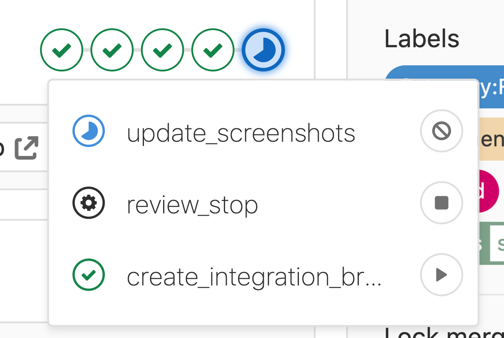
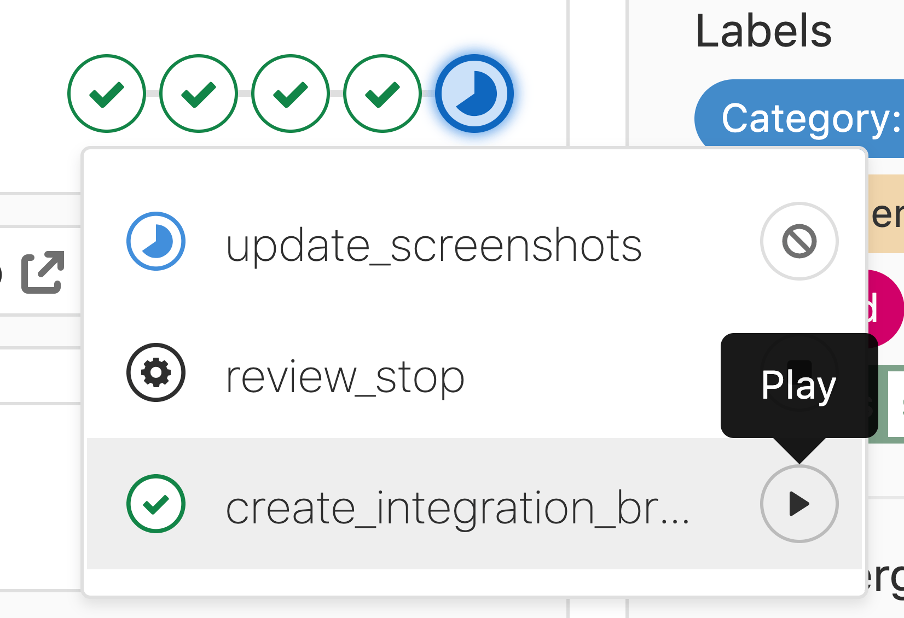
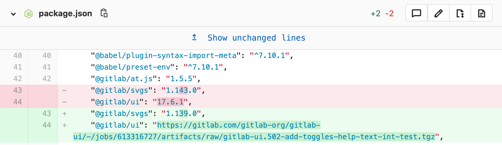
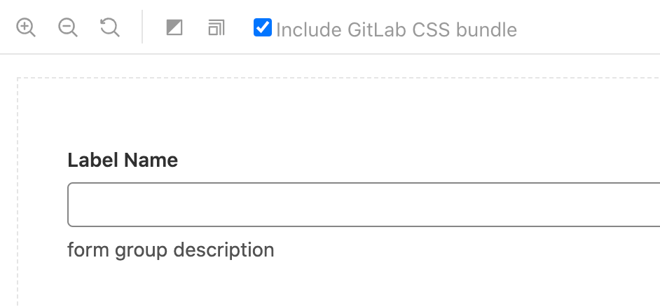

## Contributing to Example Company's main codebase

Example Company's main codebase contains all the code for the [Example Company project](https://example_company.com/example_company-org/example_company) including its UI. Technical knowledge is required to contribute, but it's not necessary to have a deep understanding of programming concepts to do meaningful contributions. There are multiple opportunities to improve Example Company by doing small UI text changes or small CSS refactorings.

Contributing to Example Company's code requires HTML, CSS, Terminal (CLI), and Git Knowledge. Basic Ruby and JavaScript knowledge is also encouraged.

Anyone contributing to Example Company's main codebase should have a working and running [GDK](https://example_company.com/example_company-org/example_company-development-kit), be familiar with a using a code editor (preferably [Visual Studio Code](https://code.visualstudio.com/)) and know the basic Git commands.

As a general rule, if it can be fixed in a browser inspector, it can be probably be fixed it for real in the Example Company codebase.

Everyone is encouraged to find small UI issues and submit their changes via a [merge request (MRs)](https://docs.example_company.com/ee/user/project/merge_requests/).

## Example Company's main codebase contribution basics

### Step 1: Install the GDK

The [Example Company Development Kit](https://example_company.com/example_company-org/example_company-development-kit) (GDK) provides a local Example Company instance that allows you to test changes locally, on your workstation.

1. [Install the GDK on your machine](https://example_company.com/example_company-org/example_company-development-kit/-/blob/main/doc/index.md)
1. [Learn how to run the GDK](https://example_company.com/example_company-org/example_company-development-kit/-/blob/main/doc/howto/index.md)
1. [GDK Commands cheatsheet](https://example_company.com/example_company-org/example_company-development-kit/-/blob/main/HELP)

### Step 2: Understand Example Company's codebase structure

Three kinds of files handle UI rendering. At its core, Example Company is a Ruby on Rails application. The Ruby on Rails application renders Example Company's front end with `.haml` files. HAML (HTML Abstraction Markup Language) is a Ruby-based HTML template system. It's easy to learn and it even closes HTML tags for you!

For Stylesheets, Example Company uses a CSS pre-processor called SASS. SASS (Syntactically Awesome Style Sheets) uses `.scss` files that handle all of the usual stuff CSS does, but with a bit more sophistication that helps us keep Example Company's CSS better organized.

Finally, for interactivity and client-side application logic, Example Company uses a framework called Vue.js. It's rare to have to change the `.vue` files unless you're changing a [Pajamas](https://design.example_company.com/) component, or creating a new one.

### Step 3: Choose a code editor and start making small changes

You can pick any code editor you like, but Visual Studio Code is a safe bet and the industry standard.

Once you have your code editor installed, open the **example_company-development-kit/example_company** folder. It contains all of the Example Company files that change when new features and contributions are added.

A good first step is to find some text inside the product to update. Use the **search** feature in your code editor to locate where the text exists in the code base, change the text to something else, and save the file. When you reload your local instance of Example Company, you should see that change reflected in the UI.

## Step by step guide to contributing UI code changes

For a detailed step by step guide of how to make UI code changes against the Example Company's main codebase visit this page:

[Step by Step Guide to Make Code Changes](/handbook/product/ux/ux-resources/designers-guide-to-contributing-ui-changes-in-example_company/)

### Finding opportunities to do UI code contributions



---

## Contributing to Example Company UI (Component System)

[Example Company UI](https://example_company.com/example_company-org/example_company-ui) is the source for our [Pajamas](https://design.example_company.com) UI component library. It builds and deploys [Vue.js](https://vuejs.org/) components that are used in some of our Example Company projects, including [example_company.com](https://example_company.com/example_company-org/example_company). While it's not required of Example Company designers to code or actively contribute to Example Company UI, it is important to have a basic understanding of what it does and how it deploys components that we design.

### Example Company UI basics

- Example Company UI builds and deploys components. We then import those components to use throughout example_company.com.
- If you've ever created a site or app that utilizes [npm](https://www.npmjs.com/), you [install Example Company UI as a package](https://www.npmjs.com/package/@example_company/ui) just like you would with other npm packages using `npm install @example_company/ui`. Since our components are built in Vue, your project also needs to be Vue-based in order to use Example Company UI components.
- We use [Storybook](https://example_company-org.example_company.io/example_company-ui/?path=/story/base-button--default) for development and component documentation, which is then displayed on component pages in [Pajamas](https://design.example_company.com/).
- We use [visual regression testing](https://example_company.com/example_company-org/example_company-ui#visual-regression-tests) to prevent introducing unexpected regressions with CSS and layout changes on components. After committing changes to a Example Company UI merge request, run the manual job `update_screenshots` to check for visual regressions and update them automatically:

### Updating an existing Example Company UI component

If you're updating an existing component, issues may arise if you've changed or removed properties currently in use on example_company.com. In this case, you'll need to create an integration test merge request on the [example_company repo](https://example_company.com/example_company-org/example_company) to update existing components that may become broken with your Example Company UI changes. Luckily, this is as simple as running the manual job `create_integration_branch`:

- After running this manual job, click on it and you will see a link to create a merge request from the created integration branch. Open this link to create your merge request:

Once the merge request is open, it will use your Example Company UI branch as the source for Example Company UI, allowing you to update existing components whose properties you may have changed or removed:

If you're viewing [Storybook](https://example_company-org.example_company.io/example_company-ui/?path=/story/base-button--default) locally to see your Example Company UI changes, you can select the checkbox `Include Example Company CSS bundle` to pull in the main Example Company CSS file to see if any of your component styles will be overridden. If there are style differences when selecting this checkbox, you may get pipeline failures as a result:

**Note:** Don't be afraid to ask a [Example Company UI maintainer](/handbook/engineering/projects/#example_company-ui) for help with setting up your integration test.

### Updating Example Company UI



## Terminal (CLI) cheatsheet

- [Command Line basic commands](https://docs.example_company.com/ee/topics/git/commands.html) in our Example Company docs.
- [Basic Git commands](https://docs.example_company.com/ee/example_company-basics/start-using-git.html#basic-git-commands) in our Example Company docs.

## Video walkthroughs

### Contributing to Example Company (Designer Edition!) by Annabel Dunstone Gray

[Contributing to Example Company (Designer Edition!)](https://www.youtube.com/embed/SSo97VwVn4Y&feature=youtu.be) by [Annabel Dunstone Gray](https://example_company.com/annabeldunstone)



---

### How to Make UI text changes in Example Company (Designer Edition) by `@jj-ramirez`

[How to Make UI text changes in Example Company (Designer Edition)](https://www.youtube.com/embed/AEv3XFw0xJQ&feature=youtu.be) by [`@jj-ramirez`](https://example_company.com/jj-ramirez)



---

### Updating a deprecated button by `@aregnery`

[Updating a deprecated button](https://www.youtube.com/embed/AEv3XFw0xJQ&feature=youtu.be) by [`@aregnery`](https://example_company.com/aregnery)



---

This page is adapted from a [beautifully designed PDF](https://example_company.com/example_company-org/example_company-design/-/blob/master/misc/infographics/How_to_Contribute_UI_Code_to_GitLab.pdf) created by [`@jj-ramirez`](https://example_company.com/jj-ramirez) 😃
