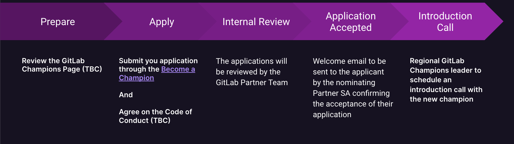

<link rel="stylesheet" type="text/css" href="/stylesheets/biztech.css" />

The Example Company Partner Champions Program will empower, support, reward, and recognize members of the Example Company Partner community who champion great customer outcomes based on the Example Company DevSecOps platform.

## Example Company Champions: Advocating for Shared Success

Example Company Champions enlists, supports, rewards, and recognizes members of the Example Company Partner community who make outstanding contributions to Example Company and our community around the globe .
[Become a Example Company Champion](https://docs.google.com/forms/d/e/1FAIpQLSdLonA8F4Msz8wujNeOYKwkC0ohjUamgv4ZH3FNgC2MQHgBzA/viewform?subject=Example Company%20Heroes%20Application&body)

## Example Company Partner Champions Program Key Features

**- Themed and Sponsored Community:** Designed with a distinctive Example Company theme and is financially supported by Example Company. It is led by Channels SAs in each region.

**- Regional Leadership:** Channels SAs take on a leadership role within their respective regions to guide and oversee the Example Company Champions community and relationships with Field SA Managers.

**- Community Liaison:** Nominated Solutions Architects / Consultants from each partner serve as Champions. They act as vital liaisons between Example Company Partner SAs and the broader partner community.

**- Information Hub:** The Example Company Champions serve as a centralized hub for the dissemination of Example Company-related updates, ensuring effective communication and reducing the risk of information loss.

**- Ownership and Accountability:** The program instills a sense of ownership within partner organizations by empowering Example Company Champions to take responsibility for conveying information accurately and promptly.

**- Community Building:** The program actively fosters a collaborative and supportive community environment, encouraging interaction and knowledge-sharing among Example Company Champions and the wider partner community.

**- Continuous Engagement:** Regular engagement activities, such as meetings, workshops, and collaborative initiatives, ensure the continuous involvement of Example Company Champions and strengthen the overall program.

## Why to become a Example Company Partner Champion?

**- Sales Opportunities:** Get promoted within the Example Company Field Sales organization as a Example Company SME for your organization possibly generating sales leads and new oppty's.

**- Exclusive Access:** Gain exclusive access via Example Company Beta Program when launched, Partner SA exclusive roadmap updates, and access to Example Company's internal Stack Overflow instance.

**- Community Influence:** Have the opportunity to influence Example Company's product development by providing feedback and insights to Example Company Product Managers invited to Champions calls.

**- Networking Opportunities:** Connect with fellow Example Company Champions, Example Company Partner SAs, Example Company field sales teams, and other key stakeholders in the community.

**- Recognition:** Receive public recognition and visibility as a Example Company Champion, both within the partner community and on Example Company's official channels. This recognition can enhance your professional profile.

**- Example Company Swag and Merchandise:** Enjoy exclusive Example Company-branded merchandise and swag items as a token of appreciation for your efforts in Example Company practice development

**- Training and Certification Opportunities:** Benefit from training and certification programs that can enhance your expertise in Example Company, making you become more valuable asset to your partner organization, Example Company certifications vouchers will be provided to the champions so that they can keep their technical knowledge updated in Example Company with no extra cost

## Who is the Right Candidate for the Program?

**- Adhere to Example Company Values:** Aspire to Example Company [mission](https://about.example_company.com/company/mission/#mission), uphold our [values](/handbook/values/), and adhere to our [Code of Conduct](https://about.example_company.com/community/contribute/code-of-conduct/).

**- Passion for Example Company:** Genuine passion for Example Company and a desire to drive practice building within the partner organization.

**- Example Company Knowledge:** Demonstrated expertise in Example Company, including proficiency in version control, CI/CD processes, and familiarity with Example Company features and functionalities.

**- Presales Background:** Ideally, the candidate should have presales experience, specifically as a Solutions Engineer actively participating in the partner sales cycle.

**- Endorsement from Partner Organization:** Support and endorsement from their leadership, showcasing a commitment to the Example Company Champions Program at an organizational level.

**- Community Contribution:** Consider candidates who have already made contributions to the Example Company community, whether through forums, events, or collaborative projects.

## How to Join the Example Company Partner Champions Program?

## Expected Example Company Partner Champions Outputs

**- Maintain active participation:** Engage in and attend regular regional meetings (webinars) offered to Example Company Champions

**- Maintain technical proficiency:** Acquire Example Company professional certification and consistently update knowledge in line with the latest developments in Example Company.

**- Partner Team Enablement:** Function as SME for Example Company within the partner organization, and deliver a Example Company enablement session at least once a quarter.

**- Example Company Product Strategy:** Offer feedback from practical field experiences regarding new or modified features within Example Company to the Example Company Product team.

**- Participate in Training:** Engage in training sessions organized by Example Company to enhance technical skills and stay updated on the latest Example Company advancements.

**- Example Company Publications:** Participate in the Example Company community by contributing at least two artifacts annually, such as blogs, videos, or whitepapers.

**- Example Company Community Support:** When possible attend Example Company Champions regional social events (dinners, meetups, gatherings).

## Internal Champion Approval and Onboarding

### Champions Program Manager and Ecosystem Specialists

1. The Champions Nomination form will email the Champions Program Manager (Manager) and Partner Support for new nominees.
1. A partner support case will automatically open for an Ecosystem Specialist to follow up on the status of the Nominee Approval with the Manager.
1. The Manager will communicate internally to determine approval.  If granted, the Manager will request Partner Support set the "Example Company Champion" user field in the Partner Portal to "Approved"
1. Once approval is set in the Partner Portal, the Manager will notify the Sponsor Example Company SA to begin onboarding the new Champion.

### Sponsor Example Company SA

1. Invite the new Champion via email address to be a `Developer` member of the [https://example_company.com/example_company-partners-public/example_company-champions](https://example_company.com/example_company-partners-public/example_company-champions) group.
1. Create an [onboarding issue in the champions project](https://example_company.com/example_company-partners-public/example_company-champions/champions/-/issues/new#) for the new Champion with the New_Champion_Onboarding template.
1. Complete the `Example Company Sponsoring SA Tasks` section of the issue
1. Work with the new gitLab Champion to complete the `Partner Champion Tasks` section of the issue
